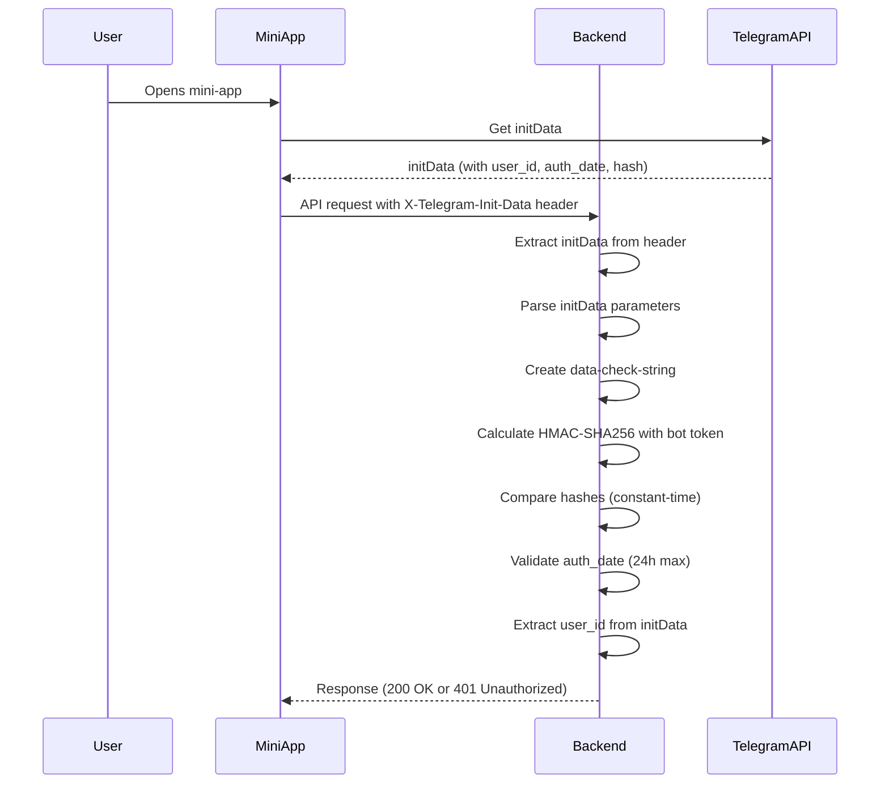

# Architecture

## System Architecture

The hookah-wishlist system follows a four-tier architecture with reverse proxy:

```
┌─────────────────┐     ┌─────────────────┐     ┌─────────────────┐
│  Telegram Bot   │────▶│  Node.js Backend│────▶│  hookah-db API  │
│  (Bot API)      │     │  (Express/Fastify)│     │  (External)     │
└─────────────────┘     └─────────────────┘     └─────────────────┘
         │                       │
         │                       ▼
         │              ┌─────────────────┐
         └─────────────▶│  Mini-App       │
                        │  (Web Frontend) │
                        └─────────────────┘
                        ▲
                        │
               ┌────────┴────────┐
               │  Nginx Reverse  │
               │     Proxy      │
               │   (Port 80)     │
               └─────────────────┘
                        │
               ┌────────┴────────┐
               │  Docker Volumes │
               │ (Persistent     │
               │   Storage)      │
               └─────────────────┘
```

### Components

1. **Telegram Bot Layer**
   - Handles incoming bot commands and interactions
   - Manages user sessions and context
   - Provides command-based interface
   - Serves as primary entry point for users

2. **Backend Service Layer**
   - RESTful API for bot and mini-app communication
   - Business logic for wishlist management
   - Data persistence layer
   - Integration with hookah-db API
   - Telegram authentication via initData verification (HMAC-SHA256)

3. **Mini-App Frontend Layer**
   - Web application embedded in Telegram
   - Rich UI for tobacco browsing and wishlist management
   - Communicates with backend via API
   - Provides enhanced user experience
   - Integrates with Telegram Web Apps API for authentication

4. **Reverse Proxy Layer**
   - Nginx service in docker-compose (nginx:alpine)
   - Unified access point on port 80
   - Routes requests to backend and mini-app via path-based routing
   - Handles SSL/TLS termination (future)
   - Provides load balancing capabilities
   - Security headers: X-Frame-Options, X-Content-Type-Options, X-XSS-Protection
   - Gzip compression for better performance
   - Health check endpoint at /health

5. **External Integration Layer**
   - hookah-db API client
   - Data fetching and caching
   - Error handling and retry logic
   - API key authentication via `X-API-Key` header

6. **Persistent Storage Layer**
   - Docker volumes for data persistence
   - SQLite database with WAL mode for wishlists
   - Survives container restarts and deployments
   - Mounted at `/app/data` in backend container
   - Manual backups only (user preference: no automated backups)

## Project Structure

The project is organized with independent subprojects - there is no monorepo structure:

```
hookah-wishlist/
├── backend/                  # Backend subproject (completely independent)
│   ├── package.json         # Backend dependencies (no shared dependencies)
│   ├── package-lock.json    # Backend lock file
│   ├── Dockerfile           # Backend Dockerfile
│   ├── tsconfig.json        # Backend TypeScript config
│   ├── .dockerignore        # Backend Docker ignore
│   └── src/                 # Backend source code
│       ├── bot/             # Telegram bot implementation
│       │   ├── commands/    # Command handlers
│       │   │   ├── start.ts
│       │   │   ├── search.ts
│       │   │   ├── wishlist.ts
│       │   │   ├── add.ts
│       │   │   ├── remove.ts
│       │   │   └── help.ts
│       │   ├── handlers/    # Event handlers
│       │   ├── middleware/  # Bot middleware
│       │   ├── bot.ts       # Main bot setup
│       │   └── session.ts   # Session management
│       ├── api/             # Backend API
│       │   ├── routes/      # API routes
│       │   │   ├── wishlist.ts
│       │   │   ├── search.ts
│       │   │   └── index.ts
│       │   ├── controllers/ # Request controllers
│       │   │   ├── search.controller.ts
│       │   │   └── wishlist.controller.ts
│       │   ├── middleware/  # Express middleware
│       │   │   ├── auth.ts  # Telegram authentication (initData verification)
│       │   │   └── errorHandler.ts
│       │   └── server.ts    # API server setup
│       ├── services/        # Business logic
│       │   ├── wishlist.service.ts
│       │   ├── search.service.ts
│       │   └── hookah-db.service.ts
│       ├── models/          # Data models
│       │   ├── user.ts
│       │   ├── wishlist.ts
│       │   └── tobacco.ts
│       ├── storage/         # Data persistence
│       │   ├── storage.interface.ts
│       │   ├── sqlite.storage.ts
│       │   └── index.ts
│       ├── utils/           # Utility functions
│       │   └── logger.ts
│       └── index.ts         # Backend entry point
├── mini-app/                # Mini-app frontend subproject (completely independent)
│   ├── package.json         # Frontend dependencies (no shared dependencies)
│   ├── package-lock.json    # Frontend lock file
│   ├── Dockerfile           # Frontend Dockerfile
│   ├── .dockerignore        # Frontend Docker ignore
│   ├── tsconfig.json        # Frontend TypeScript config
│   ├── vite.config.ts       # Vite configuration
│   ├── tailwind.config.js   # Tailwind CSS configuration
│   ├── postcss.config.js    # PostCSS configuration
│   ├── index.html           # HTML entry point
│   ├── TELEGRAM_INTEGRATION.md  # Telegram integration guide
│   ├── src/                 # Frontend source code
│   │   ├── components/     # React components
│   │   │   ├── Header.tsx
│   │   │   ├── SearchBar.tsx
│   │   │   ├── SearchResults.tsx
│   │   │   ├── TabNavigation.tsx
│   │   │   ├── TobaccoCard.tsx
│   │   │   └── Wishlist.tsx
│   │   ├── services/       # API services
│   │   │   └── api.ts      # API service with Telegram Web Apps integration
│   │   ├── store/          # State management
│   │   │   └── useStore.ts
│   │   ├── types/          # TypeScript types
│   │   │   └── index.ts
│   │   ├── hooks/          # Custom React hooks
│   │   ├── pages/          # Page components
│   │   ├── utils/          # Utility functions
│   │   ├── App.tsx         # Main App component
│   │   ├── main.tsx        # React entry point
│   │   └── index.css       # Global styles
│   └── public/             # Static assets
│       └── vite.svg
├── tests/                   # Test files
│   ├── unit/
│   ├── integration/
│   └── e2e/
├── data/                    # Data storage directory (mounted as volume)
├── docker/                  # Additional Docker configurations
│   └── nginx/              # Nginx configuration
│       └── nginx.conf      # Nginx reverse proxy config
├── docs/                    # Additional documentation
│   ├── TESTING_SUMMARY.md   # Test results and verification
│   └── DOCKER_VOLUMES.md   # Docker volumes documentation
├── .env.example             # Environment variables template
├── docker-compose.yml       # Docker Compose configuration (orchestrates independent subprojects)
├── .dockerignore           # Root Docker ignore
├── .gitignore              # Git ignore rules
├── README.md               # Project documentation
└── .kilocode/             # Kilo Code configuration
    └── rules/              # Custom rules and memory bank
        └── memory-bank/     # Memory bank files
            ├── brief.md
            ├── product.md
            ├── context.md
            ├── architecture.md
            └── tech.md
```

## Key Technical Decisions

### Independent Subprojects
- **Complete Isolation**: Each subproject (backend/ and mini-app/) has its own package.json, package-lock.json, Dockerfile, and configuration
- **No Shared Dependencies**: Subprojects are completely independent with no shared dependencies or scripts
- **No Root Package Management**: No root package.json or package-lock.json - each subproject must be managed independently
- **Docker Compose**: Orchestrates all services including reverse proxy, but each subproject is built and deployed independently
- **Independent Development**: Each subproject can be developed, tested, and deployed independently

### Backend Framework
- **Express.js** for REST API (widely adopted, extensive middleware ecosystem)
- Alternative: Fastify (better performance, built-in validation)

### Telegram Bot Library
- **node-telegram-bot-api** (mature, well-maintained)
- Alternative: telegraf (more advanced features, middleware support)

### Frontend Framework
- **React** with TypeScript for mini-app
- **Vite** for build tooling (fast HMR, modern)
- **Tailwind CSS** for styling (utility-first, small bundle)

### Telegram Authentication
- **initData Verification**: HMAC-SHA256 signature verification for secure user authentication
- **Constant-Time Comparison**: Prevents timing attacks using `crypto.timingSafeEqual()`
- **Replay Attack Prevention**: Timestamp validation with 24-hour maximum age
- **Development Mode Fallback**: Mock init data for local testing without Telegram environment
- **TypeScript Support**: @twa-dev/types for type-safe Telegram Web Apps API integration

### Reverse Proxy
- **Nginx** as reverse proxy in docker-compose (nginx:alpine image)
- Single entry point on port 80
- Path-based routing to backend API and mini-app
- Internal networking: backend and frontend ports not exposed externally
- Security headers for enhanced protection
- Gzip compression for better performance
- Health check endpoint for monitoring
- Future: SSL/TLS termination and load balancing

### Data Storage
- **Persistent Docker Volumes** for production deployment
- **SQLite database** with WAL mode for better performance and concurrency
- Mounted at `/app/data` in backend container
- Survives container restarts and deployments
- Future: PostgreSQL or MongoDB for scalability
- **Backup Strategy**: Manual backups only (user preference: no automated backups)

### State Management
- Bot: Session-based storage (Telegram user ID as key)
- Mini-App: Zustand for state management

### API Design
- RESTful API with JSON responses
- Versioning: `/api/v1/` prefix
- Authentication: Telegram user ID verification via initData
- hookah-db API: API key authentication via `X-API-Key` header

## Design Patterns

### 1. Command Pattern (Bot Commands)
Each bot command is a separate handler implementing a common interface:
```typescript
interface CommandHandler {
  name: string;
  description: string;
  execute(ctx: Context): Promise<void>;
}
```

### 2. Service Layer Pattern
Business logic separated from controllers and bot handlers:
- Controllers handle HTTP requests
- Bot handlers handle Telegram updates
- Services contain core business logic

### 3. Repository Pattern
Data access abstracted through storage interface:
```typescript
interface Storage<T> {
  get(key: string): Promise<T | null>;
  set(key: string, value: T): Promise<void>;
  delete(key: string): Promise<void>;
}
```

### 4. Factory Pattern
Command handlers registered via factory:
```typescript
class CommandFactory {
  register(command: CommandHandler): void;
  execute(commandName: string, ctx: Context): Promise<void>;
}
```

### 5. Reverse Proxy Pattern
Nginx routes requests to appropriate services:
- `/api/*` → Backend API server (port 3000, internal)
- `/mini-app/*` → Mini-app service (port 5173, internal)
- `/webhook` → Telegram bot webhook (backend, internal)
- `/health` → Health check endpoint

### 6. Authentication Middleware Pattern
Telegram authentication implemented as Express middleware:
```typescript
interface AuthenticatedRequest extends Request {
  telegramUser?: {
    userId: string;
    user: TelegramUser;
    initData: string;
  };
}
```

## Component Relationships

### Data Flow

**Bot Command Flow:**
1. User sends command to Telegram
2. Bot receives update via webhook/polling
3. Command handler processes request
4. Handler calls service layer
5. Service interacts with SQLite database and hookah-db API
6. Response formatted and sent back to user

**Mini-App Flow:**
1. User opens mini-app in Telegram
2. Mini-app receives Telegram user context via Web Apps API
3. Mini-app extracts initData from Telegram.WebApp.initData
4. Mini-app sends API requests with X-Telegram-Init-Data header
5. Backend validates initData using HMAC-SHA256 verification
6. Backend extracts user_id from validated initData
7. Backend processes request and updates SQLite database
8. Mini-app receives updated data

**Authentication Flow:**


**Reverse Proxy Flow:**
1. Client makes request to port 80 (Nginx)
2. Nginx receives request
3. Nginx routes based on path:
   - `/api/*` → Backend service (internal port 3000)
   - `/mini-app/*` → Mini-app service (internal port 5173)
   - `/webhook` → Backend service (internal port 3000)
   - `/health` → Nginx health check
4. Service processes request
5. Response returned through Nginx to client

### Critical Implementation Paths

1. **Wishlist Retrieval**
   - `/wishlist` command → `WishlistService.getWishlist(userId)` → `SQLiteStorage.get(userId)`
   - API: `GET /api/v1/wishlist` → `WishlistController.get` → `WishlistService.getWishlist`
   - Authentication: Telegram user ID extracted and validated from initData

2. **Add to Wishlist**
   - `/add [tobacco_id]` command → `WishlistService.addItem(userId, tobaccoId)` → Validate → `SQLiteStorage.update(userId, wishlist)`
   - API: `POST /api/v1/wishlist` → `WishlistController.add` → `WishlistService.addItem`
   - Authentication: Telegram user ID validated via initData verification

3. **Tobacco Search**
   - `/search [query]` command → `SearchService.search(query)` → `HookahDbService.search(query)` → Format results
   - API: `GET /api/v1/search?q=query` → `SearchController.search` → `SearchService.search`

## Integration Points

### Telegram Bot API
- Webhook for receiving updates
- Inline buttons for interactive responses
- Mini-app integration via Web Apps API
- initData for authentication in mini-app

### hookah-db API
- HTTP client with retry logic
- Response caching to reduce API calls
- Error handling for API failures
- API key authentication via `X-API-Key` header

### Mini-App Integration
- Telegram Web Apps API for user context
- Backend API for data operations
- Shared authentication via Telegram user ID
- Reverse proxy for unified access
- initData extraction and HMAC verification

### Nginx Reverse Proxy
- Single entry point on port 80
- Path-based routing to services:
  - `/api/*` → Backend API (internal port 3000)
  - `/mini-app/*` → Mini-app frontend (internal port 5173)
  - `/webhook` → Telegram bot webhook (backend, internal port 3000)
  - `/health` → Health check endpoint
- Security headers:
  - X-Frame-Options: SAMEORIGIN
  - X-Content-Type-Options: nosniff
  - X-XSS-Protection: 1; mode=block
- Gzip compression for text-based content
- Proper proxy headers (Host, X-Real-IP, X-Forwarded-For, X-Forwarded-Proto)
- Timeout configurations (60s for connect, send, read)
- Access and error logging
- Future: SSL/TLS termination

### Persistent Storage
- Docker volumes for data persistence
- SQLite database with WAL mode
- Mounted at `/app/data` in backend container
- Survives container restarts and deployments
- Manual backups only (user preference: no automated backups)

## Security Considerations

1. **Authentication**: Telegram user ID verification via initData with HMAC-SHA256
2. **Timing Attack Prevention**: Constant-time hash comparison using `crypto.timingSafeEqual()`
3. **Replay Attack Prevention**: Timestamp validation with 24-hour maximum age
4. **Input Validation**: Sanitize all user inputs
5. **Error Messages**: Don't expose sensitive information
6. **Environment Variables**: Store sensitive data securely
7. **Reverse Proxy**: Adds security layer and hides internal service ports
8. **Security Headers**: Nginx adds X-Frame-Options, X-Content-Type-Options, X-XSS-Protection
9. **Data Isolation**: Each user's data isolated by Telegram user ID
10. **API Key Security**: Securely store and use hookah-db API key
11. **Database Security**: SQLite file permissions and proper connection handling

## Scalability Considerations

1. **Horizontal Scaling**: Stateless bot and API design
2. **Caching**: In-memory caching for frequently accessed data
3. **Database Migration**: Easy transition from SQLite to PostgreSQL/MongoDB
4. **Load Balancing**: Nginx can distribute load across multiple instances
5. **Persistent Storage**: Docker volumes ensure data survives scaling events
6. **Gzip Compression**: Reduces bandwidth usage and improves response times
7. **Internal Networking**: Services communicate internally, reducing external exposure
8. **Authentication Performance**: HMAC verification is fast and scalable with proper caching

## Telegram Authentication Implementation

### Authentication Middleware

The authentication middleware is implemented in [`backend/src/api/middleware/auth.ts`](backend/src/api/middleware/auth.ts):

**Key Features:**
- Extracts initData from `X-Telegram-Init-Data` header or query parameters
- Parses URL-encoded initData parameters
- Verifies HMAC-SHA256 signature using bot token's secret key
- Validates timestamp to prevent replay attacks (24-hour max age)
- Extracts and validates user_id from initData
- Adds user information to `req.telegramUser` object

**Error Codes:**
- `MISSING_INIT_DATA` - No initData provided
- `MISSING_BOT_TOKEN` - Server configuration error
- `INVALID_SIGNATURE` - HMAC verification failed
- `EXPIRED_AUTH_DATA` - Timestamp too old or invalid
- `MISSING_USER_DATA` - User parameter missing
- `INVALID_USER_DATA` - User data parsing failed
- `AUTHENTICATION_FAILED` - General authentication error

### Frontend Integration

The frontend integrates with Telegram Web Apps API in [`mini-app/src/services/api.ts`](mini-app/src/services/api.ts):

**Key Features:**
- Automatic initData extraction from `Telegram.WebApp.initData`
- Development mode fallback with mock authentication data
- Request interceptor adds `X-Telegram-Init-Data` header to all API requests
- Response interceptor handles authentication errors (401, 403, 404, 429, 500+)
- Utility methods for Telegram Web Apps API integration

**Utility Methods:**
- `initializeTelegram()`: Initializes Telegram Web Apps API
- `isTelegramAvailable()`: Checks if app is running in Telegram
- `getTelegramUser()`: Retrieves current Telegram user information
- `createMockInitData()`: Generates mock init data for development testing

### Security Measures

1. **HMAC-SHA256 Verification**: Prevents tampering with initData
2. **Constant-Time Comparison**: Prevents timing attacks
3. **Timestamp Validation**: Prevents replay attacks
4. **Input Validation**: All user inputs validated before use
5. **Error Message Safety**: No sensitive information in error responses
