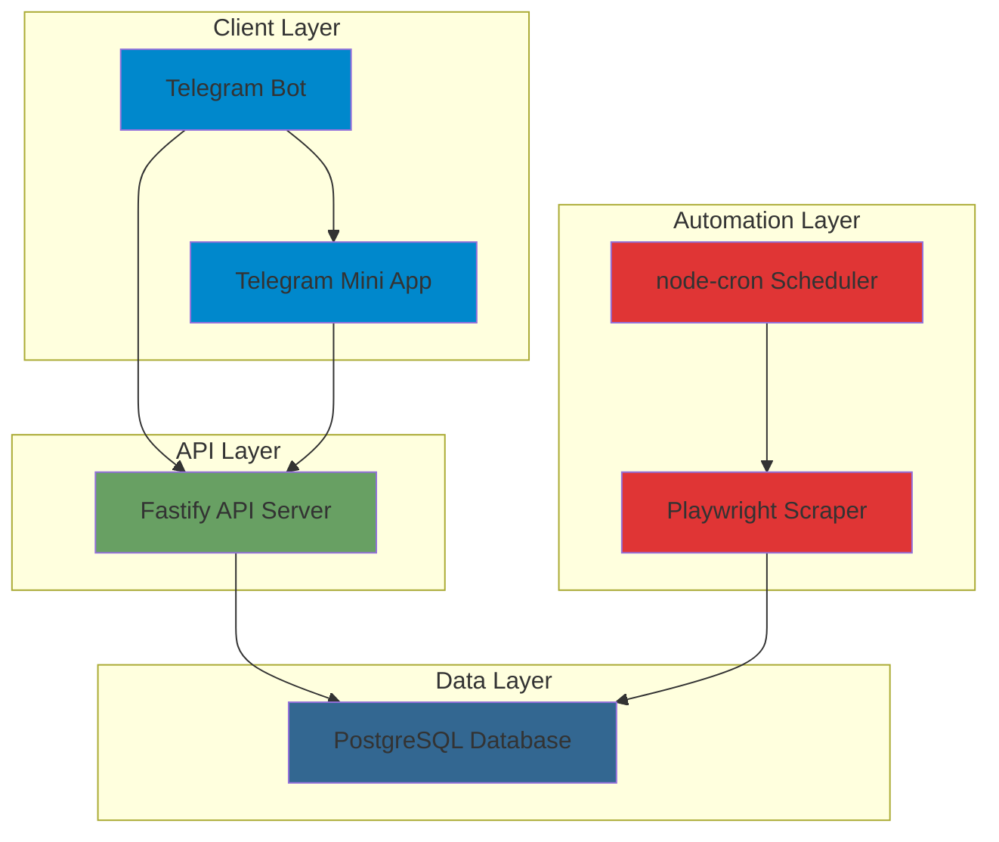

# Technology Stack Selection

## Overview

This document outlines the technology choices for the Hookah Wishlist System, selected based on current industry trends (2025), community support, performance characteristics, and suitability for the project requirements.

## Selection Criteria

The technology stack was evaluated based on:
- **Popularity & Community Support** - Active development, large community, good documentation
- **Performance** - Fast execution, efficient resource usage
- **Developer Experience** - Modern tooling, type safety, ease of development
- **Scalability** - Ability to grow from MVP to production
- **Ecosystem** - Rich library ecosystem for required features
- **Maintenance** - Long-term viability and stability

## Technology Stack

### Backend

#### Runtime: Node.js 20+ LTS
- **Justification**: 
  - Excellent performance for I/O-bound operations
  - Large ecosystem with mature libraries
  - Great for real-time features (WebSocket support)
  - TypeScript support out of the box
  - Unified stack with frontend (JavaScript/TypeScript)
  - Strong community and corporate backing (OpenJS Foundation)

#### Framework: Fastify 4+
- **Justification**:
  - Fastest Node.js web framework (benchmarks show 2-3x faster than Express)
  - Built-in JSON schema validation
  - TypeScript-first design with excellent type inference
  - Plugin architecture for extensibility
  - Low overhead and memory footprint
  - Active development and growing community

#### API Style: REST
- **Justification**:
  - Simpler than GraphQL for this use case
  - Better caching support (HTTP caching)
  - Easier to debug and monitor
  - Sufficient for the current requirements
  - Better client compatibility

#### ORM: Prisma 5+
- **Justification**:
  - Type-safe database client with excellent TypeScript integration
  - Modern, intuitive API design
  - Automatic migrations and schema management
  - Excellent performance with connection pooling
  - Built-in query builder and raw SQL support
  - Active development and strong community
  - Supports PostgreSQL, MySQL, SQLite, MongoDB

#### Database: PostgreSQL 16+
- **Justification**:
  - Most advanced open-source relational database
  - Excellent performance for read-heavy workloads
  - JSONB support for flexible data structures
  - Strong data integrity and ACID compliance
  - Full-text search capabilities
  - Extensible architecture
  - Excellent replication and backup tools

### Frontend

#### Framework: React 18+ with TypeScript
- **Justification**:
  - Most popular frontend framework with largest ecosystem
  - Excellent TypeScript support
  - Virtual DOM for efficient updates
  - Rich component ecosystem
  - Strong community and long-term viability
  - Extensive learning resources
  - Great for Mini App development

#### Build Tool: Vite 5+
- **Justification**:
  - Extremely fast development server with HMR
  - Optimized production builds
  - Native ESM support
  - TypeScript and JSX support out of the box
  - Plugin ecosystem
  - Modern and actively maintained

#### UI Library: Tailwind CSS 4+ with Headless UI
- **Justification**:
  - Utility-first CSS for rapid development
  - Small bundle size (purges unused styles)
  - Design system consistency
  - Headless UI provides accessible, unstyled components
  - Easy customization
  - Great for Telegram Mini App styling

#### State Management: Zustand 4+
- **Justification**:
  - Minimal boilerplate compared to Redux
  - TypeScript-friendly
  - Simple API with hooks
  - No context provider needed
  - Excellent performance
  - Perfect size for this application

#### HTTP Client: Axios 1+
- **Justification**:
  - Promise-based API
  - Request/response interceptors
  - Automatic JSON transformation
  - Request cancellation support
  - Excellent TypeScript support
  - Widely used and well-maintained

### Telegram Integration

#### Bot Library: Telegraf 4+
- **Justification**:
  - Full Telegram Bot API 7.1+ support
  - Middleware-based architecture
  - TypeScript support with type definitions
  - Session management built-in
  - Excellent documentation and examples
  - Active development and large community
  - Supports both bot commands and Web App initData

#### Web App SDK: @telegram-apps/sdk
- **Justification**:
  - Official Telegram Web App SDK
  - TypeScript support
  - Provides access to Telegram API (theme, user data, etc.)
  - Regular updates with new Telegram features
  - Well-documented

### Web Scraping

#### Library: Playwright 1.40+
- **Justification**:
  - Supports multiple browsers (Chromium, Firefox, WebKit)
  - Excellent for dynamic content (JavaScript-rendered pages)
  - Auto-waiting for elements and network requests
  - Built-in screenshot and PDF generation
  - Strong TypeScript support
  - Better anti-detection than Puppeteer
  - Active development by Microsoft

#### Scheduling: node-cron 3+
- **Justification**:
  - Simple cron job scheduling
  - Lightweight and dependency-free
  - TypeScript support
  - Well-tested and stable
  - Easy to integrate with Node.js applications

### DevOps & Infrastructure

#### Containerization: Docker & Docker Compose
- **Justification**:
  - Consistent development and production environments
  - Easy deployment and scaling
  - Isolation of dependencies
  - Industry standard
  - Great for local development

#### Process Manager: PM2 5+
- **Justification**:
  - Process management for Node.js applications
  - Automatic restarts on crashes
  - Cluster mode for multi-core utilization
  - Log management
  - Easy monitoring
  - Production-ready

#### Reverse Proxy: Nginx
- **Justification**:
  - High performance and low memory footprint
  - SSL/TLS termination
  - Load balancing capabilities
  - Static file serving
  - Industry standard
  - Excellent documentation

#### Monitoring: Winston 3+ (Logging) & Prometheus (Metrics)
- **Justification**:
  - Winston: Flexible logging with multiple transports
  - Prometheus: Industry-standard metrics collection
  - Grafana: Beautiful dashboards for metrics visualization
  - Together provide comprehensive observability

### Development Tools

#### Language: TypeScript 5+
- **Justification**:
  - Type safety catches errors at compile time
  - Excellent IDE support (VS Code, WebStorm)
  - Better code documentation through types
  - Refactoring confidence
  - Industry standard for modern JavaScript projects

#### Code Quality: ESLint 8+ & Prettier 3+
- **Justification**:
  - ESLint: Code linting and error detection
  - Prettier: Code formatting consistency
  - Together ensure code quality and style consistency
  - Highly configurable
  - Large plugin ecosystem

#### Testing: Vitest 1+ & Playwright 1.40+
- **Justification**:
  - Vitest: Fast unit testing (compatible with Jest API)
  - Playwright: E2E testing for Mini App
  - TypeScript support
  - Modern and actively maintained
  - Great developer experience

#### Version Control: Git
- **Justification**:
  - Industry standard
  - Excellent branching and merging
  - Distributed workflow
  - Large ecosystem of tools

## Technology Stack Summary

| Component | Technology | Version | Purpose |
|-----------|-----------|---------|---------|
| **Backend Runtime** | Node.js | 20+ LTS | Server-side JavaScript runtime |
| **Backend Framework** | Fastify | 4+ | Web framework and API server |
| **API Style** | REST | - | API architecture pattern |
| **ORM** | Prisma | 5+ | Database ORM and migrations |
| **Database** | PostgreSQL | 16+ | Primary database |
| **Frontend Framework** | React | 18+ | UI framework for Mini App |
| **Build Tool** | Vite | 5+ | Build tool and dev server |
| **CSS Framework** | Tailwind CSS | 4+ | Utility-first CSS |
| **UI Components** | Headless UI | - | Accessible component library |
| **State Management** | Zustand | 4+ | Client-side state management |
| **HTTP Client** | Axios | 1+ | HTTP requests |
| **Telegram Bot** | Telegraf | 4+ | Telegram Bot API wrapper |
| **Telegram Web App** | @telegram-apps/sdk | latest | Web App integration |
| **Web Scraping** | Playwright | 1.40+ | Browser automation |
| **Job Scheduling** | node-cron | 3+ | Cron job scheduler |
| **Containerization** | Docker | latest | Container runtime |
| **Process Manager** | PM2 | 5+ | Process manager |
| **Reverse Proxy** | Nginx | latest | Web server and reverse proxy |
| **Logging** | Winston | 3+ | Logging library |
| **Testing** | Vitest | 1+ | Unit testing |
| **E2E Testing** | Playwright | 1.40+ | End-to-end testing |
| **Language** | TypeScript | 5+ | Type-safe JavaScript |

## Architecture Diagram

## Alternative Technologies Considered

### Backend Frameworks
- **Express.js**: Rejected in favor of Fastify for better performance and TypeScript support
- **NestJS**: Rejected due to complexity overkill for this project size
- **Koa**: Rejected due to smaller community and ecosystem

### Frontend Frameworks
- **Vue.js**: Good alternative, but React has larger ecosystem and better Mini App support
- **Svelte**: Excellent performance, but smaller ecosystem and fewer learning resources
- **Solid.js**: Great performance, but newer with smaller community

### ORMs
- **TypeORM**: Good alternative, but Prisma has better TypeScript support and developer experience
- **Sequelize**: Older, more verbose API, less type-safe
- **MikroORM**: Excellent, but smaller community than Prisma

### Databases
- **MySQL**: Good alternative, but PostgreSQL has more advanced features
- **MongoDB**: Rejected as relational model fits requirements better
- **SQLite**: Good for development, but PostgreSQL better for production

### Telegram Libraries
- **node-telegram-bot-api**: Good alternative, but Telegraf has better middleware system
- **aiogram (Python)**: Excellent, but would require Python backend
- **grammY**: Good modern alternative, but Telegraf has larger community

## Scalability Considerations

The chosen stack is designed to scale from MVP to production:

1. **Horizontal Scaling**: Fastify + PostgreSQL can be scaled horizontally
2. **Caching**: Redis can be added for caching (not needed for MVP)
3. **Load Balancing**: Nginx can distribute traffic across multiple API instances
4. **Database Scaling**: PostgreSQL supports read replicas and partitioning
5. **Message Queue**: BullMQ can be added for background jobs (not needed for MVP)

## Security Considerations

1. **Authentication**: Telegram initData validation for Mini App
2. **Authorization**: Role-based access control (if needed)
3. **Input Validation**: Fastify JSON schema validation
4. **SQL Injection**: Prisma provides protection via parameterized queries
5. **XSS Protection**: React's built-in escaping
6. **Rate Limiting**: Fastify rate limiting plugin
7. **CORS**: Configured for Telegram domains only

## Maintenance & Updates

- **LTS Versions**: Using LTS versions of Node.js and PostgreSQL
- **Regular Updates**: Monthly dependency updates
- **Security Patches**: Immediate updates for critical vulnerabilities
- **Monitoring**: Logging and metrics for proactive issue detection

## Conclusion

The selected technology stack provides:
- ✅ Modern, future-proof technologies
- ✅ Strong community support and documentation
- ✅ Excellent developer experience
- ✅ Type safety throughout the stack
- ✅ Performance optimization
- ✅ Scalability for future growth
- ✅ Security best practices
- ✅ Easy deployment and maintenance

This stack is well-suited for building a clean, modern, and potentially scalable hookah tobacco wishlist system.
