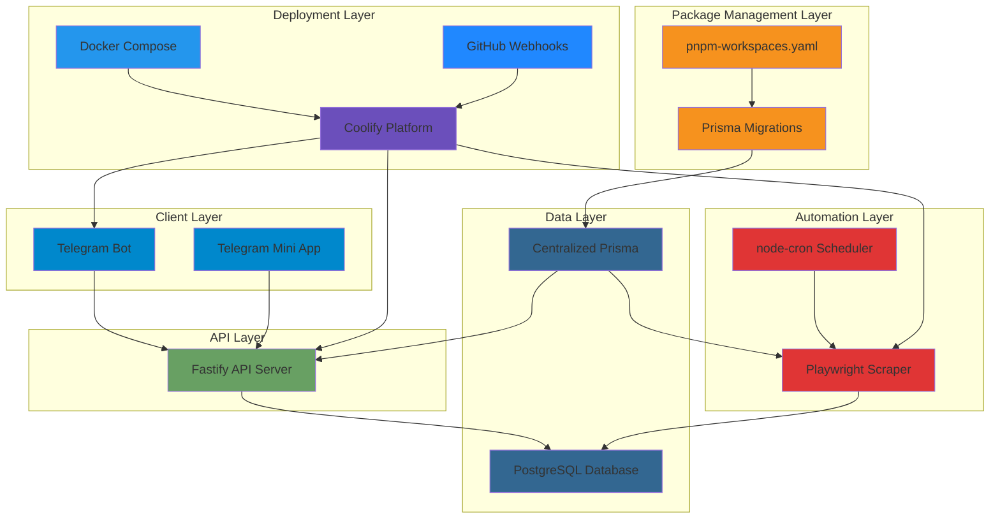

# Technology Stack Selection

## Overview

This document outlines the technology choices for the Hookah Wishlist System, selected based on current industry trends (2025), community support, performance characteristics, and suitability for the project requirements. The system is designed for containerized deployment using Docker Compose and production deployment via Coolify platform. The project uses **pnpm workspaces** for monorepo management with centralized Prisma configuration.

## Selection Criteria

The technology stack was evaluated based on:
- **Popularity & Community Support** - Active development, large community, good documentation
- **Performance** - Fast execution, efficient resource usage
- **Developer Experience** - Modern tooling, type safety, ease of development
- **Scalability** - Ability to grow from MVP to production
- **Ecosystem** - Rich library ecosystem for required features
- **Maintenance** - Long-term viability and stability
- **Containerization Ready** - Native support for Docker and container orchestration
- **Monorepo Support** - Efficient workspace management for multi-package projects

## Technology Stack

### Package Management

#### Package Manager: pnpm 9+
- **Justification**:
  - Faster than npm and yarn due to efficient disk space usage (hard links)
  - Strict dependency management prevents phantom dependencies
  - Native workspace support for monorepo architecture
  - Smaller node_modules size saves disk space and build time
  - Better performance for CI/CD pipelines
  - Excellent TypeScript support
  - Compatible with all Node.js projects
  - Supports shared dependencies across workspaces

#### Workspace Configuration: pnpm-workspaces.yaml
- **Justification**:
  - Single repository for all project components
  - Shared dependencies reduce duplication
  - Unified version management
  - Simplified CI/CD pipeline
  - Easy to add new components
  - Consistent tooling across all packages

### Backend

#### Runtime: Node.js 22+ LTS
- **Justification**:
  - Excellent performance for I/O-bound operations
  - Large ecosystem with mature libraries
  - Great for real-time features (WebSocket support)
  - TypeScript support out of the box
  - Unified stack with frontend (JavaScript/TypeScript)
  - Strong community and corporate backing (OpenJS Foundation)
  - Excellent Docker support

#### Framework: Fastify 5+
- **Justification**:
  - Fastest Node.js web framework (benchmarks show 2-3x faster than Express)
  - Built-in JSON schema validation
  - TypeScript-first design with excellent type inference
  - Plugin architecture for extensibility
  - Low overhead and memory footprint
  - Active development and growing community
  - Container-friendly architecture

#### API Style: REST
- **Justification**:
  - Simpler than GraphQL for this use case
  - Better caching support (HTTP caching)
  - Easier to debug and monitor
  - Sufficient for the current requirements
  - Better client compatibility

#### ORM: Prisma 7.2.0+ (Centralized)
- **Justification**:
  - Type-safe database client with excellent TypeScript integration
  - Modern, intuitive API design with improved performance in v7
  - Automatic migrations and schema management
  - Excellent performance with connection pooling
  - Built-in query builder and raw SQL support
  - Active development and strong community
  - Supports PostgreSQL, MySQL, SQLite, MongoDB
  - Enhanced TypeScript support with stricter type checking
  - Improved error messages and debugging experience
  - **Centralized Configuration**: Single Prisma schema and migrations shared across API and scraper
  - **Workspace Integration**: Seamless integration with pnpm workspaces
  - **Shared Client**: Both API and scraper use the same Prisma Client instance

#### Database: PostgreSQL 16+
- **Justification**:
  - Most advanced open-source relational database
  - Excellent performance for read-heavy workloads
  - JSONB support for flexible data structures
  - Strong data integrity and ACID compliance
  - Full-text search capabilities
  - Extensible architecture
  - Excellent replication and backup tools
  - Official Docker images available

### Frontend

#### Framework: React 19+ with TypeScript
- **Justification**:
  - Most popular frontend framework with largest ecosystem
  - Excellent TypeScript support
  - Virtual DOM for efficient updates
  - Rich component ecosystem
  - Strong community and long-term viability
  - Extensive learning resources
  - Great for Mini App development
  - Latest version with improved performance and features

#### Build Tool: Vite 7+
- **Justification**:
  - Extremely fast development server with HMR
  - Optimized production builds
  - Native ESM support
  - TypeScript and JSX support out of the box
  - Plugin ecosystem
  - Modern and actively maintained
  - Excellent Docker integration

#### UI Library: Tailwind CSS 4+ with Headless UI
- **Justification**:
  - Utility-first CSS for rapid development
  - Small bundle size (purges unused styles)
  - Design system consistency
  - Headless UI provides accessible, unstyled components
  - Easy customization
  - Great for Telegram Mini App styling

#### State Management: Zustand 5+
- **Justification**:
  - Minimal boilerplate compared to Redux
  - TypeScript-friendly
  - Simple API with hooks
  - No context provider needed
  - Excellent performance
  - Perfect size for this application

#### HTTP Client: Axios 1+
- **Justification**:
  - Promise-based API
  - Request/response interceptors
  - Automatic JSON transformation
  - Request cancellation support
  - Excellent TypeScript support
  - Widely used and well-maintained

### Telegram Integration

#### Bot Library: Telegraf 4+
- **Justification**:
  - Full Telegram Bot API 7.1+ support
  - Middleware-based architecture
  - TypeScript support with type definitions
  - Session management built-in
  - Excellent documentation and examples
  - Active development and large community
  - Supports both bot commands and Web App initData

#### Web App SDK: @telegram-apps/sdk
- **Justification**:
  - Official Telegram Web App SDK
  - TypeScript support
  - Provides access to Telegram API (theme, user data, etc.)
  - Regular updates with new Telegram features
  - Well-documented

### Web Scraping

#### Library: Playwright 1.57+
- **Justification**:
  - Supports multiple browsers (Chromium, Firefox, WebKit)
  - Excellent for dynamic content (JavaScript-rendered pages)
  - Auto-waiting for elements and network requests
  - Built-in screenshot and PDF generation
  - Strong TypeScript support
  - Better anti-detection than Puppeteer
  - Active development by Microsoft
  - Container-friendly with Docker support
  - **Fully Implemented**: Complete scraper logic with brand and tobacco scraping

#### Scheduling: node-cron 4+
- **Justification**:
  - Simple cron job scheduling
  - Lightweight and dependency-free
  - TypeScript support
  - Well-tested and stable
  - Easy to integrate with Node.js applications
  - Works well in containerized environments
  - **Implemented**: Daily scraping schedule with configurable cron expression

### DevOps & Infrastructure

#### Containerization: Docker & Docker Compose
- **Justification**:
  - Consistent development and production environments
  - Easy deployment and scaling
  - Isolation of dependencies
  - Industry standard
  - Great for local development
  - Perfect for Coolify deployment
  - Simplifies dependency management (no local PostgreSQL needed)

#### Deployment Platform: Coolify
- **Justification**:
  - Self-hosted PaaS platform
  - GitHub integration with webhooks
  - Automatic deployments on push
  - Docker Compose support
  - Built-in SSL/TLS certificates
  - Easy environment variable management
  - Cost-effective compared to managed services
  - Supports custom domains

#### Reverse Proxy: Traefik (via Coolify)
- **Justification**:
  - Automatic service discovery
  - Built-in SSL/TLS termination
  - Load balancing capabilities
  - Dynamic configuration
  - Container-native
  - Integrated with Docker Compose

#### Monitoring: Winston 3+ (Logging)
- **Justification**:
  - Flexible logging with multiple transports
  - JSON format for structured logging
  - Multiple log levels
  - Easy integration with external log aggregators
  - Container-friendly

### Development Tools

#### Language: TypeScript 5+
- **Justification**:
  - Type safety catches errors at compile time
  - Excellent IDE support (VS Code, WebStorm)
  - Better code documentation through types
  - Refactoring confidence
  - Industry standard for modern JavaScript projects

#### Code Quality: ESLint 9+ & Prettier 3+
- **Justification**:
  - ESLint: Code linting and error detection
  - Prettier: Code formatting consistency
  - Together ensure code quality and style consistency
  - Highly configurable
  - Large plugin ecosystem

## Technology Stack Summary

| Component | Technology | Version | Purpose |
|-----------|-----------|---------|---------|
| **Package Manager** | pnpm | 9+ | Fast, efficient package management with workspaces |
| **Workspaces** | pnpm-workspaces | - | Monorepo management for multi-package project |
| **Backend Runtime** | Node.js | 22+ LTS | Server-side JavaScript runtime |
| **Backend Framework** | Fastify | 5+ | Web framework and API server |
| **API Style** | REST | - | API architecture pattern |
| **ORM** | Prisma | 7.2.0+ | Database ORM and migrations (centralized) |
| **Database** | PostgreSQL | 16+ | Primary database (via Docker) |
| **Frontend Framework** | React | 19+ | UI framework for Mini App |
| **Build Tool** | Vite | 7+ | Build tool and dev server |
| **CSS Framework** | Tailwind CSS | 4+ | Utility-first CSS |
| **UI Components** | Headless UI | - | Accessible component library |
| **State Management** | Zustand | 5+ | Client-side state management |
| **HTTP Client** | Axios | 1+ | HTTP requests |
| **Telegram Bot** | Telegraf | 4+ | Telegram Bot API wrapper |
| **Telegram Web App** | @telegram-apps/sdk | latest | Web App integration |
| **Web Scraping** | Playwright | 1.57+ | Browser automation (implemented) |
| **Job Scheduling** | node-cron | 4+ | Cron job scheduler (implemented) |
| **Containerization** | Docker | latest | Container runtime |
| **Orchestration** | Docker Compose | latest | Multi-container orchestration |
| **Deployment Platform** | Coolify | latest | PaaS deployment platform |
| **Reverse Proxy** | Traefik | latest | Load balancer and SSL (via Coolify) |
| **Logging** | Winston | 3+ | Logging library |
| **Language** | TypeScript | 5+ | Type-safe JavaScript |

## Architecture Diagram



## Monorepo Architecture

### Workspace Structure

The project uses pnpm workspaces to manage multiple packages:

```yaml
# pnpm-workspace.yaml
packages:
  - 'api'
  - 'scraper'
  - 'bot'
  - 'mini-app'
```

### Benefits of pnpm Workspaces

1. **Shared Dependencies**: Common packages installed once at root
2. **Faster Installs**: Hard links reduce disk usage and install time
3. **Consistent Versions**: All workspaces use same dependency versions
4. **Simplified CI/CD**: Single install command for all packages
5. **Local Linking**: Workspaces can import each other without publishing
6. **Type Safety**: TypeScript cross-references work across workspaces

### Centralized Prisma Configuration

Prisma configuration is centralized at project root:

```
project-root/
├── prisma/
│   ├── schema.prisma          # Shared database schema
│   └── migrations/            # Shared migration files
├── prisma.config.ts           # Prisma configuration
├── api/
│   └── package.json           # Imports @prisma/client
├── scraper/
│   └── package.json           # Imports @prisma/client
└── pnpm-workspace.yaml         # Workspace configuration
```

Both API and scraper import Prisma Client from the same installation, ensuring schema consistency.

## Alternative Technologies Considered

### Package Managers
- **npm**: Replaced by pnpm for better performance and workspace support
- **yarn**: Good alternative, but pnpm is faster and more efficient

### Backend Frameworks
- **Express.js**: Rejected in favor of Fastify for better performance and TypeScript support
- **NestJS**: Rejected due to complexity overkill for this project size
- **Koa**: Rejected due to smaller community and ecosystem

### Frontend Frameworks
- **Vue.js**: Good alternative, but React has larger ecosystem and better Mini App support
- **Svelte**: Excellent performance, but smaller ecosystem and fewer learning resources
- **Solid.js**: Great performance, but newer with smaller community

### ORMs
- **TypeORM**: Good alternative, but Prisma has better TypeScript support and developer experience
- **Sequelize**: Older, more verbose API, less type-safe
- **MikroORM**: Excellent, but smaller community than Prisma
- **Prisma 5.x**: Upgrading to 7.2.0+ for improved TypeScript support and performance

### Databases
- **MySQL**: Good alternative, but PostgreSQL has more advanced features
- **MongoDB**: Rejected as relational model fits requirements better
- **SQLite**: Good for development, but PostgreSQL better for production

### Telegram Libraries
- **node-telegram-bot-api**: Good alternative, but Telegraf has better middleware system
- **aiogram (Python)**: Excellent, but would require Python backend
- **grammY**: Good modern alternative, but Telegraf has larger community

### Deployment Platforms
- **VPS with PM2/Nginx**: Replaced by Coolify for easier deployment and management
- **Heroku**: Good alternative, but more expensive and less control
- **Vercel**: Great for static sites, but limited for Node.js backends
- **Railway**: Good alternative, but Coolify offers more control and cost-effectiveness

## Scalability Considerations

The chosen stack is designed to scale from MVP to production:

1. **Horizontal Scaling**: Fastify + PostgreSQL can be scaled horizontally via Coolify
2. **Caching**: Redis can be added for caching (not needed for MVP)
3. **Load Balancing**: Coolify provides built-in load balancing
4. **Database Scaling**: PostgreSQL supports read replicas and partitioning
5. **Message Queue**: BullMQ can be added for background jobs (not needed for MVP)
6. **Container Orchestration**: Docker Compose makes scaling straightforward
7. **Workspace Scalability**: pnpm workspaces easily accommodate new packages

## Security Considerations

1. **Authentication**: Telegram initData validation for Mini App
2. **Authorization**: Role-based access control (if needed)
3. **Input Validation**: Fastify JSON schema validation
4. **SQL Injection**: Prisma provides protection via parameterized queries
5. **XSS Protection**: React's built-in escaping
6. **Rate Limiting**: Fastify rate limiting plugin
7. **CORS**: Configured for Telegram domains only
8. **Container Security**: Docker provides isolation and security boundaries
9. **Secrets Management**: Coolify provides secure environment variable management
10. **Dependency Security**: pnpm's strict mode prevents phantom dependencies

## Maintenance & Updates

- **LTS Versions**: Using LTS versions of Node.js and PostgreSQL
- **Regular Updates**: Monthly dependency updates via Coolify automatic deployments
- **Security Patches**: Immediate updates for critical vulnerabilities
- **Monitoring**: Logging and metrics for proactive issue detection
- **Container Updates**: Easy to update Docker images and dependencies
- **Workspace Management**: pnpm makes it easy to update all workspaces simultaneously

## Containerization Benefits

Using Docker Compose and Coolify provides:

- **Environment Consistency**: Same environment across development, staging, and production
- **Dependency Isolation**: No conflicts between project dependencies
- **Easy Setup**: Single command to start entire stack
- **Scalability**: Easy to scale services horizontally
- **Rollback**: Quick rollback to previous versions via Coolify
- **Cost Efficiency**: Better resource utilization compared to VPS
- **Simplified Operations**: No manual server management

## Monorepo Benefits

Using pnpm workspaces provides:

- **Unified Codebase**: All components in one repository
- **Shared Dependencies**: Reduced duplication and faster installs
- **Cross-Workspace Imports**: Easy to share code between packages
- **Simplified CI/CD**: Single pipeline for all components
- **Consistent Tooling**: Same linter, formatter, TypeScript config everywhere
- **Easier Onboarding**: New developers clone one repo

## Conclusion

The selected technology stack provides:
- ✅ Modern, future-proof technologies
- ✅ Strong community support and documentation
- ✅ Excellent developer experience
- ✅ Type safety throughout the stack
- ✅ Performance optimization
- ✅ Scalability for future growth
- ✅ Security best practices
- ✅ Easy deployment and maintenance
- ✅ Containerized architecture
- ✅ Automated deployment via Coolify
- ✅ No local PostgreSQL installation required
- ✅ Efficient monorepo management with pnpm workspaces
- ✅ Centralized Prisma configuration for schema consistency
- ✅ Implemented scraper with Playwright and node-cron
- ✅ Shared dependencies across workspaces

This stack is well-suited for building a clean, modern, and potentially scalable hookah tobacco wishlist system with streamlined deployment process and efficient monorepo management.
