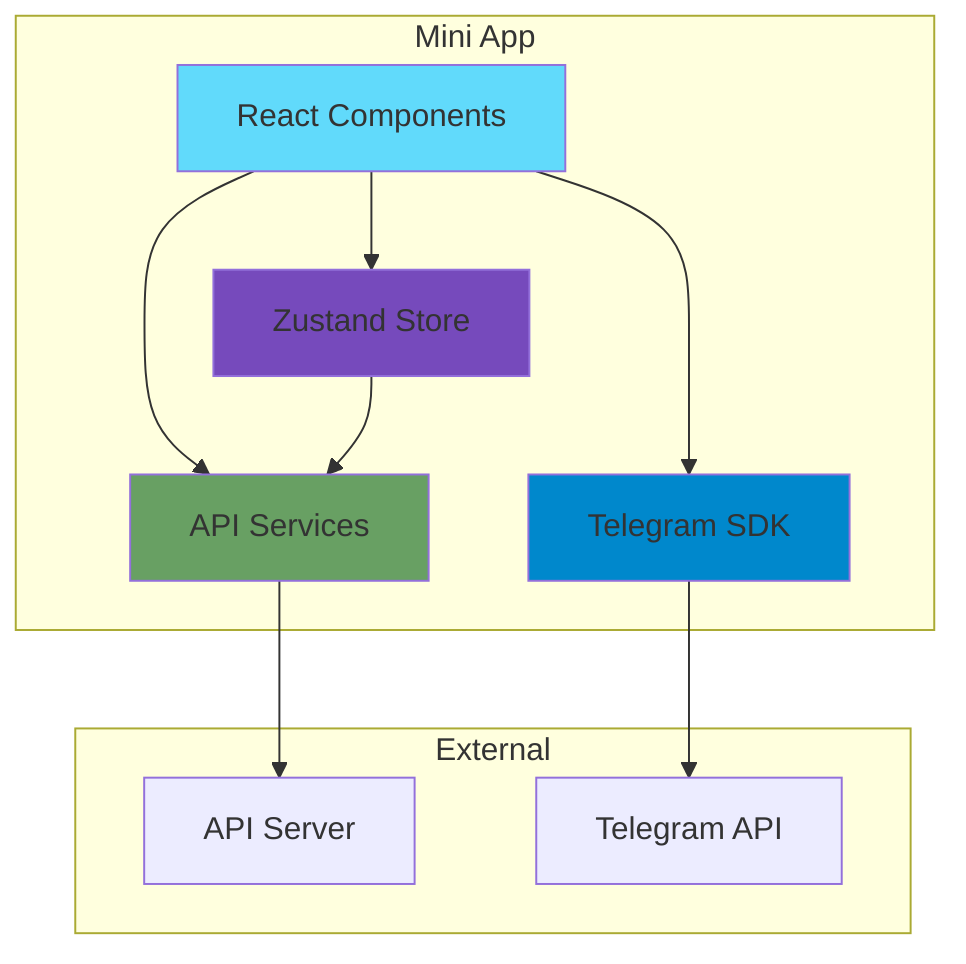

# Mini App Architecture

## Overview

The Mini App is a web-based application that runs inside Telegram, providing a rich, interactive interface for managing hookah tobacco wishlists. It offers a superior user experience compared to the text-based bot, with images, smooth animations, and intuitive touch interactions.

## Technology Stack

### Core Technologies

- **Framework**: React 18+ with TypeScript
- **Build Tool**: Vite 5+
- **Styling**: Tailwind CSS 4+
- **UI Components**: Headless UI
- **State Management**: Zustand 4+
- **HTTP Client**: Axios 1+
- **Telegram Integration**: @telegram-apps/sdk
- **Icons**: Lucide React

### Development Tools

- **TypeScript**: 5+ for type safety
- **ESLint**: Code linting
- **Prettier**: Code formatting
- **Vitest**: Unit testing
- **Playwright**: E2E testing

## Project Structure

```
mini-app/
├── src/
│   ├── components/          # React components
│   │   ├── ui/             # Reusable UI components
│   │   ├── wishlist/       # Wishlist-specific components
│   │   ├── search/         # Search components
│   │   └── layout/         # Layout components
│   ├── pages/              # Page components
│   ├── hooks/              # Custom React hooks
│   ├── stores/             # Zustand stores
│   ├── services/           # API services
│   ├── types/              # TypeScript types
│   ├── utils/              # Utility functions
│   ├── constants/          # Constants and config
│   ├── App.tsx             # Root component
│   └── main.tsx            # Entry point
├── public/                 # Static assets
├── index.html              # HTML template
├── vite.config.ts          # Vite configuration
├── tailwind.config.js      # Tailwind configuration
└── tsconfig.json           # TypeScript configuration
```

## Architecture Diagram



## Core Features

### 1. Authentication

**Flow**:
1. Mini App receives `initData` from Telegram
2. Validates `initData` with API server
3. Receives JWT token
4. Stores token for subsequent requests

**Implementation**:
```typescript
// services/auth.ts
export const authenticate = async (initData: string) => {
  const response = await api.post('/auth/telegram', { initData });
  const { token, user } = response.data.data;
  
  // Store token
  localStorage.setItem('token', token);
  
  // Update user store
  useAuthStore.getState().setUser(user);
  
  return { token, user };
};
```

### 2. Wishlist Management

**Features**:
- View wishlist items with images
- Add items from search or manually
- Remove items from wishlist
- Mark items as purchased
- Filter by status (active/purchased)

**Component Structure**:
```
WishlistPage
├── WishlistHeader
├── WishlistFilter
├── WishlistList
│   ├── WishlistItem
│   ├── WishlistItem
│   └── ...
└── AddItemButton
```

### 3. Tobacco Search

**Features**:
- Real-time search by name or brand
- Filter by brand
- Display results with images
- Add directly to wishlist
- View tobacco details

**Search Flow**:
```
User types → Debounce → API request → Display results
```

### 4. Brand Browser

**Features**:
- Browse all brands
- View tobaccos by brand
- Filter by brand
- Quick add to wishlist

### 5. User Profile

**Features**:
- View user information
- Change language
- Toggle notifications
- View statistics

## Component Design

### UI Components (Reusable)

#### Button

```typescript
interface ButtonProps {
  variant?: 'primary' | 'secondary' | 'danger' | 'ghost';
  size?: 'sm' | 'md' | 'lg';
  loading?: boolean;
  children: React.ReactNode;
  onClick?: () => void;
}
```

#### Card

```typescript
interface CardProps {
  children: React.ReactNode;
  onClick?: () => void;
  className?: string;
}
```

#### Input

```typescript
interface InputProps {
  type?: 'text' | 'search';
  placeholder?: string;
  value: string;
  onChange: (value: string) => void;
  debounce?: number;
}
```

#### Modal

```typescript
interface ModalProps {
  isOpen: boolean;
  onClose: () => void;
  title?: string;
  children: React.ReactNode;
}
```

### Feature Components

#### WishlistItem

Displays a single wishlist item with actions.

```typescript
interface WishlistItemProps {
  item: WishlistItem;
  onRemove: () => void;
  onTogglePurchased: () => void;
}
```

**Features**:
- Display tobacco image (from htreviews.org)
- Show brand and name
- Purchase status indicator
- Quick actions (remove, mark purchased)
- Swipe actions (mobile)

#### TobaccoCard

Displays a tobacco in search results.

```typescript
interface TobaccoCardProps {
  tobacco: Tobacco;
  onAdd: () => void;
  onViewDetails: () => void;
}
```

**Features**:
- Tobacco image
- Brand and name
- Description preview
- Add to wishlist button
- View details button

#### SearchBar

Search input with real-time results.

```typescript
interface SearchBarProps {
  onSearch: (query: string) => void;
  onFilterByBrand?: (brand: string) => void;
}
```

**Features**:
- Debounced input
- Clear button
- Brand filter dropdown
- Loading indicator

## State Management

### Zustand Stores

#### Auth Store

```typescript
interface AuthState {
  user: User | null;
  token: string | null;
  isAuthenticated: boolean;
  setUser: (user: User) => void;
  setToken: (token: string) => void;
  logout: () => void;
}

export const useAuthStore = create<AuthState>((set) => ({
  user: null,
  token: localStorage.getItem('token'),
  isAuthenticated: !!localStorage.getItem('token'),
  setUser: (user) => set({ user, isAuthenticated: true }),
  setToken: (token) => {
    localStorage.setItem('token', token);
    set({ token, isAuthenticated: true });
  },
  logout: () => {
    localStorage.removeItem('token');
    set({ user: null, token: null, isAuthenticated: false });
  },
}));
```

#### Wishlist Store

```typescript
interface WishlistState {
  items: WishlistItem[];
  loading: boolean;
  error: string | null;
  filter: 'all' | 'active' | 'purchased';
  fetchWishlist: () => Promise<void>;
  addItem: (item: AddWishlistItem) => Promise<void>;
  removeItem: (itemId: number) => Promise<void>;
  togglePurchased: (itemId: number) => Promise<void>;
  setFilter: (filter: FilterType) => void;
}

export const useWishlistStore = create<WishlistState>((set, get) => ({
  items: [],
  loading: false,
  error: null,
  filter: 'active',
  
  fetchWishlist: async () => {
    set({ loading: true, error: null });
    try {
      const response = await api.get('/wishlist');
      set({ items: response.data.data.items, loading: false });
    } catch (error) {
      set({ error: 'Failed to fetch wishlist', loading: false });
    }
  },
  
  addItem: async (item) => {
    set({ loading: true, error: null });
    try {
      const response = await api.post('/wishlist/items', item);
      set({ 
        items: [...get().items, response.data.data],
        loading: false 
      });
    } catch (error) {
      set({ error: 'Failed to add item', loading: false });
    }
  },
  
  removeItem: async (itemId) => {
    set({ loading: true, error: null });
    try {
      await api.delete(`/wishlist/items/${itemId}`);
      set({ 
        items: get().items.filter(item => item.id !== itemId),
        loading: false 
      });
    } catch (error) {
      set({ error: 'Failed to remove item', loading: false });
    }
  },
  
  togglePurchased: async (itemId) => {
    set({ loading: true, error: null });
    try {
      const response = await api.patch(`/wishlist/items/${itemId}/purchased`);
      set({ 
        items: get().items.map(item => 
          item.id === itemId ? response.data.data : item
        ),
        loading: false 
      });
    } catch (error) {
      set({ error: 'Failed to update item', loading: false });
    }
  },
  
  setFilter: (filter) => set({ filter }),
}));
```

#### Search Store

```typescript
interface SearchState {
  query: string;
  results: Tobacco[];
  loading: boolean;
  error: string | null;
  selectedBrand: string | null;
  setQuery: (query: string) => void;
  setSelectedBrand: (brand: string | null) => void;
  search: () => Promise<void>;
  clear: () => void;
}

export const useSearchStore = create<SearchState>((set, get) => ({
  query: '',
  results: [],
  loading: false,
  error: null,
  selectedBrand: null,
  
  setQuery: (query) => set({ query }),
  setSelectedBrand: (brand) => set({ selectedBrand: brand }),
  
  search: async () => {
    const { query, selectedBrand } = get();
    if (!query && !selectedBrand) return;
    
    set({ loading: true, error: null });
    try {
      const params: any = {};
      if (query) params.search = query;
      if (selectedBrand) params.brand = selectedBrand;
      
      const response = await api.get('/tobaccos', { params });
      set({ results: response.data.data.tobaccos, loading: false });
    } catch (error) {
      set({ error: 'Search failed', loading: false });
    }
  },
  
  clear: () => set({ query: '', results: [], selectedBrand: null, error: null }),
}));
```

## API Services

### API Client Configuration

```typescript
// services/api.ts
import axios from 'axios';

const API_BASE_URL = import.meta.env.VITE_API_URL || 'https://api.yourdomain.com/api/v1';

export const api = axios.create({
  baseURL: API_BASE_URL,
  headers: {
    'Content-Type': 'application/json',
  },
});

// Request interceptor - Add auth token
api.interceptors.request.use((config) => {
  const token = localStorage.getItem('token');
  if (token) {
    config.headers.Authorization = `Bearer ${token}`;
  }
  return config;
});

// Response interceptor - Handle errors
api.interceptors.response.use(
  (response) => response,
  (error) => {
    if (error.response?.status === 401) {
      // Token expired, redirect to login
      useAuthStore.getState().logout();
    }
    return Promise.reject(error);
  }
);
```

### Service Functions

```typescript
// services/wishlist.ts
export const wishlistService = {
  getWishlist: (includePurchased = false) => 
    api.get('/wishlist', { params: { includePurchased } }),
  
  addItem: (item: AddWishlistItem) => 
    api.post('/wishlist/items', item),
  
  removeItem: (itemId: number) => 
    api.delete(`/wishlist/items/${itemId}`),
  
  markPurchased: (itemId: number) => 
    api.patch(`/wishlist/items/${itemId}/purchased`),
  
  clearPurchased: () => 
    api.delete('/wishlist/purchased'),
};

// services/tobacco.ts
export const tobaccoService = {
  searchTobaccos: (params: SearchParams) => 
    api.get('/tobaccos', { params }),
  
  getTobacco: (id: number) => 
    api.get(`/tobaccos/${id}`),
  
  getBrands: () => 
    api.get('/brands'),
  
  getBrand: (slug: string) => 
    api.get(`/brands/${slug}`),
};

// services/auth.ts
export const authService = {
  authenticate: (initData: string) => 
    api.post('/auth/telegram', { initData }),
  
  getCurrentUser: () => 
    api.get('/users/me'),
};
```

## Custom Hooks

### useDebounce

```typescript
function useDebounce<T>(value: T, delay: number): T {
  const [debouncedValue, setDebouncedValue] = useState<T>(value);

  useEffect(() => {
    const handler = setTimeout(() => {
      setDebouncedValue(value);
    }, delay);

    return () => {
      clearTimeout(handler);
    };
  }, [value, delay]);

  return debouncedValue;
}
```

### useTelegramTheme

```typescript
function useTelegramTheme() {
  const [theme, setTheme] = useState<TelegramTheme | null>(null);

  useEffect(() => {
    const tg = window.Telegram.WebApp;
    tg.ready();
    
    setTheme({
      bgColor: tg.themeParams.bg_color,
      textColor: tg.themeParams.text_color,
      hintColor: tg.themeParams.hint_color,
      linkColor: tg.themeParams.link_color,
      buttonColor: tg.themeParams.button_color,
      buttonTextColor: tg.themeParams.button_text_color,
    });

    // Listen for theme changes
    tg.onEvent('themeChanged', () => {
      setTheme({
        bgColor: tg.themeParams.bg_color,
        textColor: tg.themeParams.text_color,
        hintColor: tg.themeParams.hint_color,
        linkColor: tg.themeParams.link_color,
        buttonColor: tg.themeParams.button_color,
        buttonTextColor: tg.themeParams.button_text_color,
      });
    });
  }, []);

  return theme;
}
```

### useInfiniteScroll

```typescript
function useInfiniteScroll(
  callback: () => void,
  hasMore: boolean
) {
  const [isFetching, setIsFetching] = useState(false);

  useEffect(() => {
    if (!hasMore || isFetching) return;

    const handleScroll = () => {
      if (
        window.innerHeight + document.documentElement.scrollTop
        >= document.documentElement.offsetHeight - 100
      ) {
        setIsFetching(true);
      }
    };

    window.addEventListener('scroll', handleScroll);
    return () => window.removeEventListener('scroll', handleScroll);
  }, [hasMore, isFetching]);

  useEffect(() => {
    if (isFetching) {
      callback().then(() => setIsFetching(false));
    }
  }, [isFetching, callback]);

  return [isFetching, setIsFetching] as const;
}
```

## Pages

### WishlistPage

Main page displaying user's wishlist.

```typescript
export function WishlistPage() {
  const { items, loading, filter, fetchWishlist, setFilter } = useWishlistStore();
  const theme = useTelegramTheme();

  useEffect(() => {
    fetchWishlist();
  }, [fetchWishlist]);

  const filteredItems = items.filter(item => {
    if (filter === 'all') return true;
    if (filter === 'active') return !item.isPurchased;
    if (filter === 'purchased') return item.isPurchased;
  });

  return (
    <div className="min-h-screen" style={{ backgroundColor: theme?.bgColor }}>
      <WishlistHeader />
      <WishlistFilter filter={filter} onFilterChange={setFilter} />
      
      {loading ? (
        <LoadingSpinner />
      ) : filteredItems.length === 0 ? (
        <EmptyState />
      ) : (
        <WishlistList items={filteredItems} />
      )}
      
      <AddItemButton />
    </div>
  );
}
```

### SearchPage

Search and browse tobaccos.

```typescript
export function SearchPage() {
  const { query, results, loading, search, setQuery } = useSearchStore();
  const debouncedQuery = useDebounce(query, 300);

  useEffect(() => {
    if (debouncedQuery) {
      search();
    }
  }, [debouncedQuery, search]);

  return (
    <div className="min-h-screen">
      <SearchBar
        value={query}
        onChange={setQuery}
        onSearch={search}
      />
      
      {loading ? (
        <LoadingSpinner />
      ) : results.length > 0 ? (
        <TobaccoList tobaccos={results} />
      ) : query ? (
        <NoResults />
      ) : (
        <SearchSuggestions />
      )}
    </div>
  );
}
```

### BrandPage

View tobaccos by brand.

```typescript
export function BrandPage({ slug }: { slug: string }) {
  const [brand, setBrand] = useState<Brand | null>(null);
  const [tobaccos, setTobaccos] = useState<Tobacco[]>([]);
  const [loading, setLoading] = useState(true);

  useEffect(() => {
    async function loadBrand() {
      setLoading(true);
      try {
        const response = await api.get(`/brands/${slug}`);
        setBrand(response.data.data);
        setTobaccos(response.data.data.tobaccos);
      } catch (error) {
        console.error('Failed to load brand:', error);
      } finally {
        setLoading(false);
      }
    }
    loadBrand();
  }, [slug]);

  if (loading) return <LoadingSpinner />;
  if (!brand) return <NotFound />;

  return (
    <div className="min-h-screen">
      <BrandHeader brand={brand} />
      <TobaccoList tobaccos={tobaccos} />
    </div>
  );
}
```

## Navigation

### Bottom Navigation

```typescript
export function BottomNavigation() {
  const location = useLocation();
  
  const tabs = [
    { path: '/', icon: List, label: 'Список' },
    { path: '/search', icon: Search, label: 'Поиск' },
    { path: '/brands', icon: Package, label: 'Бренды' },
    { path: '/profile', icon: User, label: 'Профиль' },
  ];

  return (
    <nav className="fixed bottom-0 left-0 right-0 bg-white border-t">
      {tabs.map((tab) => (
        <Link
          key={tab.path}
          to={tab.path}
          className={`flex flex-col items-center p-2 ${
            location.pathname === tab.path ? 'text-blue-500' : 'text-gray-500'
          }`}
        >
          <tab.icon size={24} />
          <span className="text-xs">{tab.label}</span>
        </Link>
      ))}
    </nav>
  );
}
```

### Routing

```typescript
// App.tsx
import { BrowserRouter, Routes, Route } from 'react-router-dom';

export function App() {
  return (
    <BrowserRouter>
      <Routes>
        <Route path="/" element={<WishlistPage />} />
        <Route path="/search" element={<SearchPage />} />
        <Route path="/brands" element={<BrandsPage />} />
        <Route path="/brands/:slug" element={<BrandPage />} />
        <Route path="/profile" element={<ProfilePage />} />
        <Route path="/tobacco/:id" element={<TobaccoDetailPage />} />
      </Routes>
      <BottomNavigation />
    </BrowserRouter>
  );
}
```

## Telegram Integration

### Initialization

```typescript
// main.tsx
import { WebApp } from '@telegram-apps/sdk';

const tg = WebApp;

// Initialize Web App
tg.ready();
tg.expand();

// Enable closing confirmation
tg.enableClosingConfirmation();

// Set header color
tg.setHeaderColor(tg.themeParams.bg_color);

// Set background color
tg.setBackgroundColor(tg.themeParams.bg_color);
```

### Theme Integration

```typescript
// Apply Telegram theme to Tailwind
const theme = {
  extend: {
    colors: {
      'tg-bg': 'var(--tg-theme-bg-color)',
      'tg-text': 'var(--tg-theme-text-color)',
      'tg-hint': 'var(--tg-theme-hint-color)',
      'tg-link': 'var(--tg-theme-link-color)',
      'tg-button': 'var(--tg-theme-button-color)',
      'tg-button-text': 'var(--tg-theme-button-text-color)',
    },
  },
};
```

### Haptic Feedback

```typescript
function useHapticFeedback() {
  const tg = window.Telegram.WebApp;

  return {
    impact: (style: 'light' | 'medium' | 'heavy' | 'rigid' | 'soft') => {
      tg.HapticFeedback.impactOccurred(style);
    },
    notification: (type: 'error' | 'success' | 'warning') => {
      tg.HapticFeedback.notificationOccurred(type);
    },
    selection: () => {
      tg.HapticFeedback.selectionChanged();
    },
  };
}
```

### Main Button

```typescript
function useMainButton() {
  const tg = window.Telegram.WebApp;

  const showButton = (text: string, onClick: () => void) => {
    tg.MainButton.text = text;
    tg.MainButton.onClick(onClick);
    tg.MainButton.show();
  };

  const hideButton = () => {
    tg.MainButton.hide();
  };

  return { showButton, hideButton };
}
```

## Performance Optimization

### Code Splitting

```typescript
const WishlistPage = lazy(() => import('./pages/WishlistPage'));
const SearchPage = lazy(() => import('./pages/SearchPage'));
const BrandPage = lazy(() => import('./pages/BrandPage'));

// In App.tsx
<Suspense fallback={<LoadingSpinner />}>
  <Routes>
    <Route path="/" element={<WishlistPage />} />
    <Route path="/search" element={<SearchPage />} />
    <Route path="/brands" element={<BrandPage />} />
  </Routes>
</Suspense>
```

### Image Optimization

```typescript
function OptimizedImage({ src, alt, className }: ImageProps) {
  const [loaded, setLoaded] = useState(false);
  const [error, setError] = useState(false);

  return (
    <div className={className}>
      {!loaded && !error && <ImageSkeleton />}
       setLoaded(true)}
        onError={() => setError(true)}
        loading="lazy"
      />
      {error && <ImageError />}
    </div>
  );
}
```

### Virtual Scrolling

For large lists, use virtual scrolling:

```typescript
import { useVirtualizer } from '@tanstack/react-virtual';

function VirtualList({ items }: { items: WishlistItem[] }) {
  const parentRef = useRef<HTMLDivElement>(null);

  const virtualizer = useVirtualizer({
    count: items.length,
    getScrollElement: () => parentRef.current,
    estimateSize: () => 80,
  });

  return (
    <div ref={parentRef} className="h-96 overflow-auto">
      <div
        style={{
          height: `${virtualizer.getTotalSize()}px`,
          position: 'relative',
        }}
      >
        {virtualizer.getVirtualItems().map((virtualItem) => (
          <div
            key={virtualItem.key}
            style={{
              position: 'absolute',
              top: 0,
              left: 0,
              width: '100%',
              transform: `translateY(${virtualItem.start}px)`,
            }}
          >
            <WishlistItem item={items[virtualItem.index]} />
          </div>
        ))}
      </div>
    </div>
  );
}
```

## Testing

### Unit Tests

```typescript
// __tests__/components/WishlistItem.test.tsx
import { render, screen, fireEvent } from '@testing-library/react';
import { WishlistItem } from '../WishlistItem';

describe('WishlistItem', () => {
  const mockItem = {
    id: 1,
    isPurchased: false,
    tobacco: {
      id: 1,
      name: 'Зима',
      brand: { name: 'Sarma' },
      imageUrl: 'https://example.com/image.jpg',
    },
  };

  it('renders tobacco name and brand', () => {
    render(<WishlistItem item={mockItem} onRemove={jest.fn()} onTogglePurchased={jest.fn()} />);
    expect(screen.getByText('Sarma - Зима')).toBeInTheDocument();
  });

  it('calls onRemove when remove button is clicked', () => {
    const onRemove = jest.fn();
    render(<WishlistItem item={mockItem} onRemove={onRemove} onTogglePurchased={jest.fn()} />);
    
    fireEvent.click(screen.getByLabelText('Remove'));
    expect(onRemove).toHaveBeenCalled();
  });
});
```

### E2E Tests

```typescript
// e2e/wishlist.spec.ts
import { test, expect } from '@playwright/test';

test('user can add tobacco to wishlist', async ({ page }) => {
  await page.goto('/search');
  
  await page.fill('[data-testid="search-input"]', 'Зима');
  await page.waitForSelector('[data-testid="tobacco-card"]');
  
  await page.click('[data-testid="add-to-wishlist-button"]');
  await expect(page.locator('[data-testid="toast-success"]')).toBeVisible();
  
  await page.goto('/');
  await expect(page.locator('text=Sarma - Зима')).toBeVisible();
});
```

## Deployment

### Build Configuration

```typescript
// vite.config.ts
export default defineConfig({
  build: {
    outDir: 'dist',
    sourcemap: true,
    rollupOptions: {
      output: {
        manualChunks: {
          'react-vendor': ['react', 'react-dom', 'react-router-dom'],
          'ui-vendor': ['@headlessui/react', 'lucide-react'],
        },
      },
    },
  },
});
```

### Environment Variables

```env
VITE_API_URL=https://api.yourdomain.com/api/v1
VITE_TELEGRAM_BOT_USERNAME=your_bot_username
```

### Deployment Steps

1. Build the app:
```bash
npm run build
```

2. Deploy to static hosting (Vercel, Netlify, or custom server):
```bash
# Upload dist/ directory to your hosting
```

3. Configure Telegram BotFather:
```
Web App URL: https://yourdomain.com/mini-app/
```

## Summary

The Mini App provides:

✅ **Rich UI** - Modern, responsive interface with images
✅ **Telegram Integration** - Native look and feel
✅ **Fast Performance** - Optimized for mobile devices
✅ **Type Safety** - Full TypeScript support
✅ **State Management** - Efficient state handling with Zustand
✅ **Testing** - Comprehensive unit and E2E tests
✅ **Accessibility** - Accessible components with Headless UI
✅ **Scalability** - Code splitting and virtual scrolling

The Mini App offers a superior user experience compared to the text-based bot, with intuitive touch interactions, smooth animations, and visual feedback.
