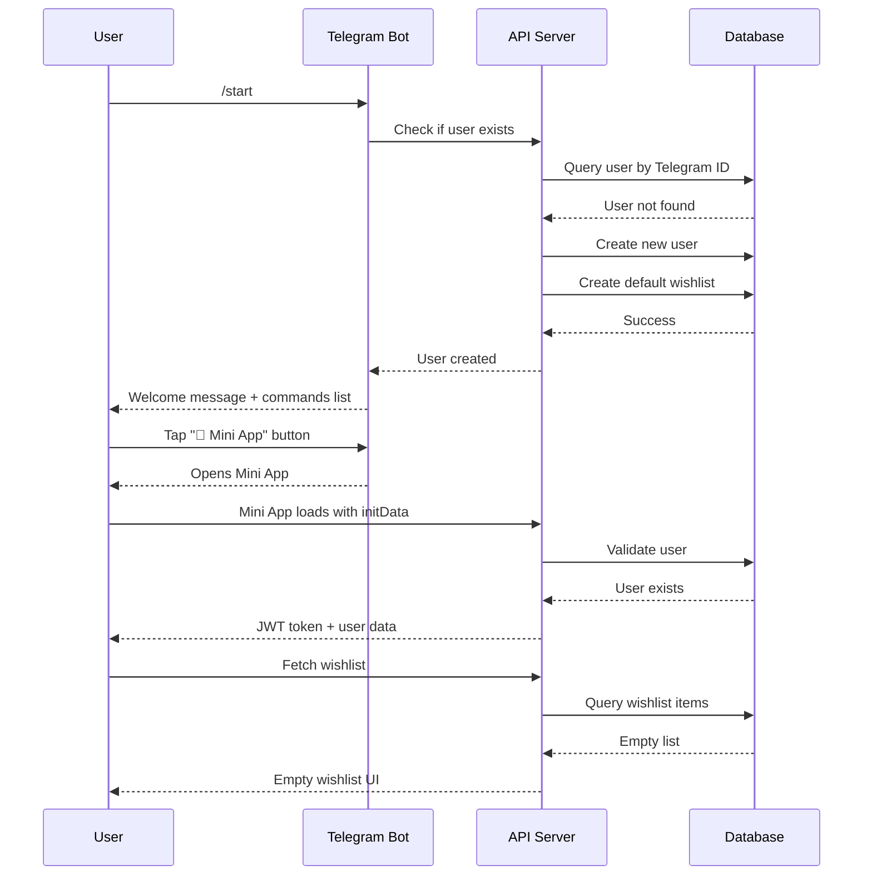
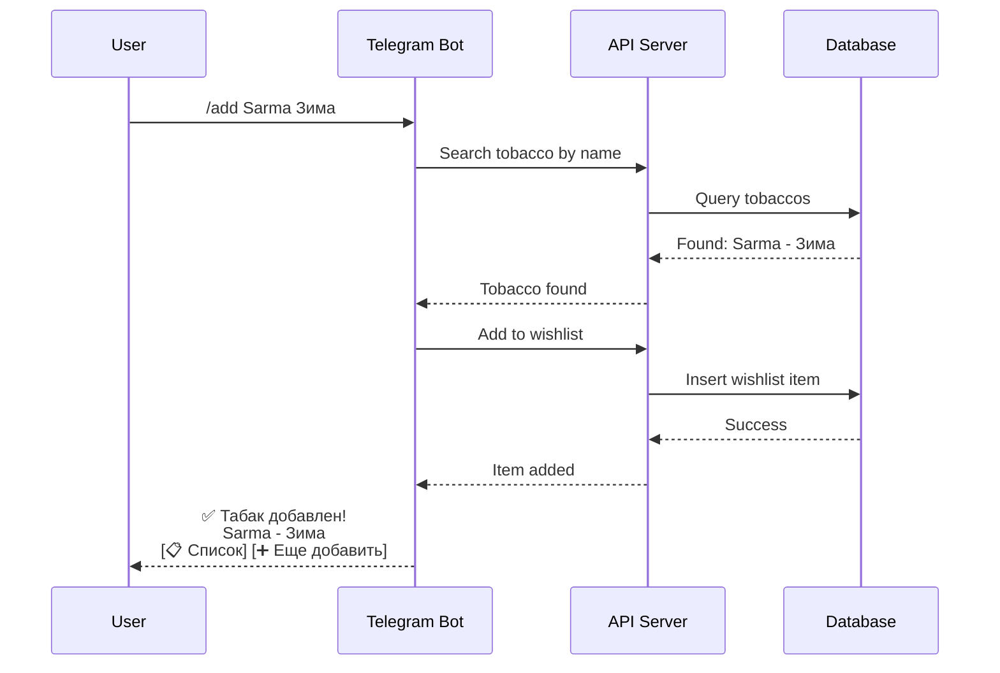
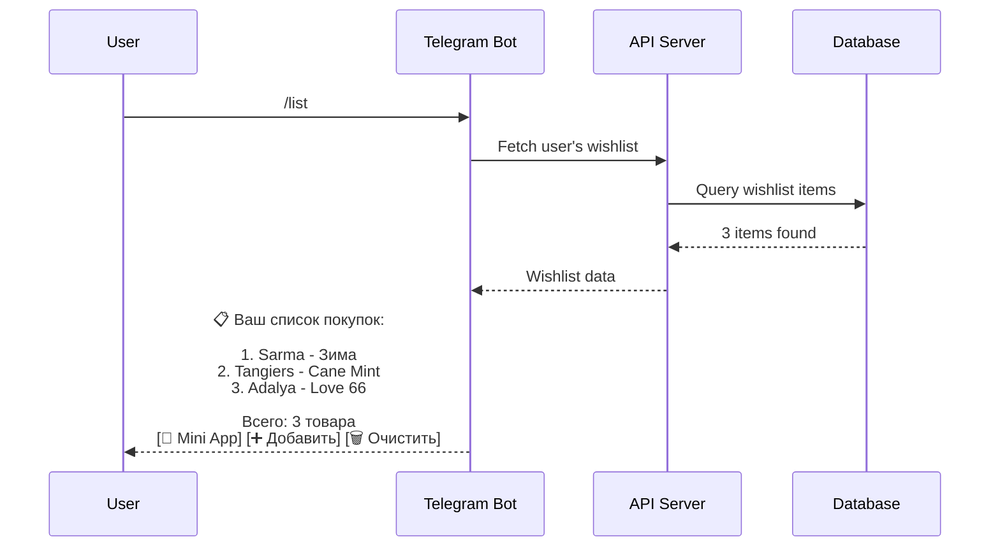
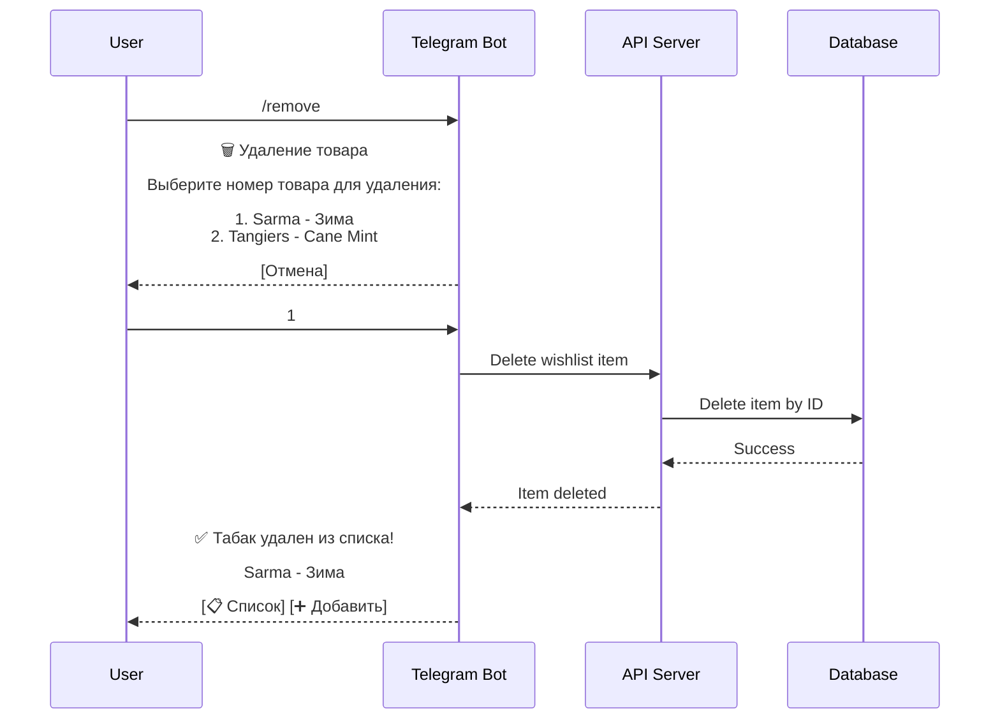
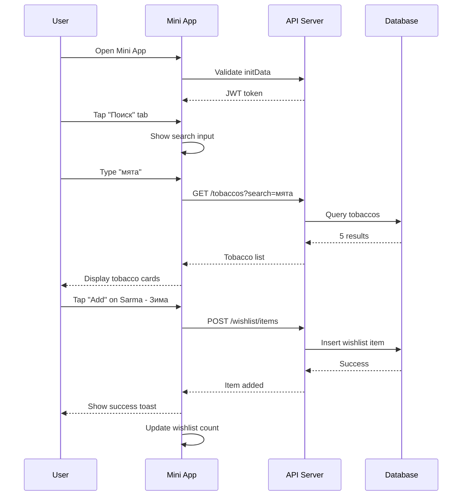
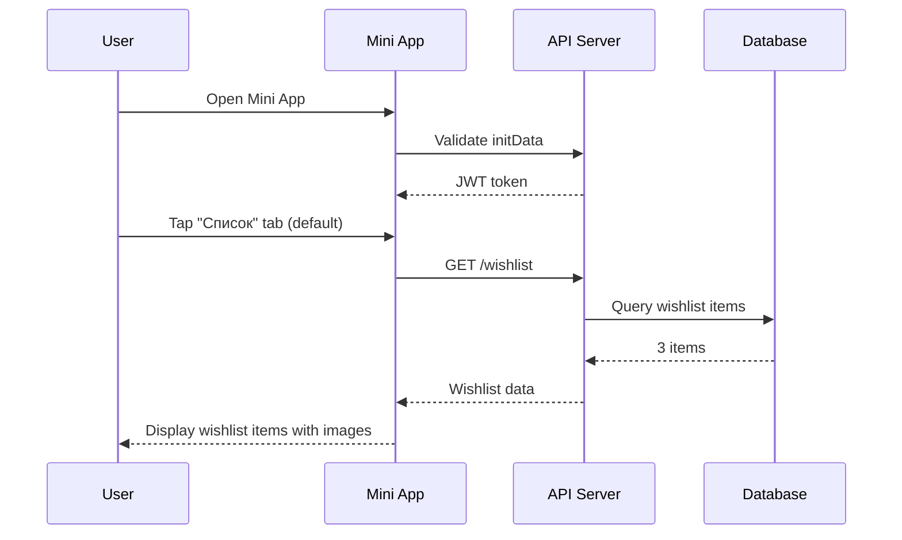
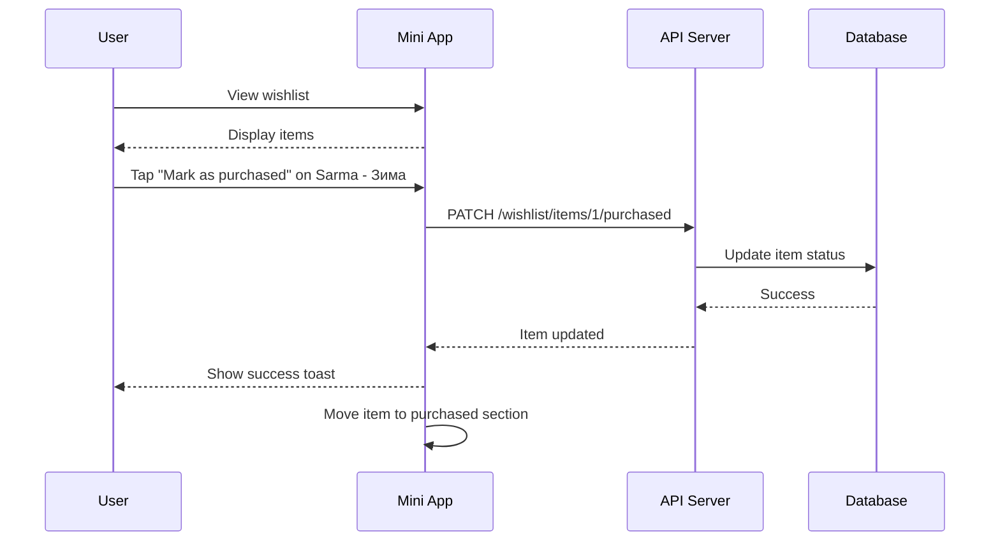
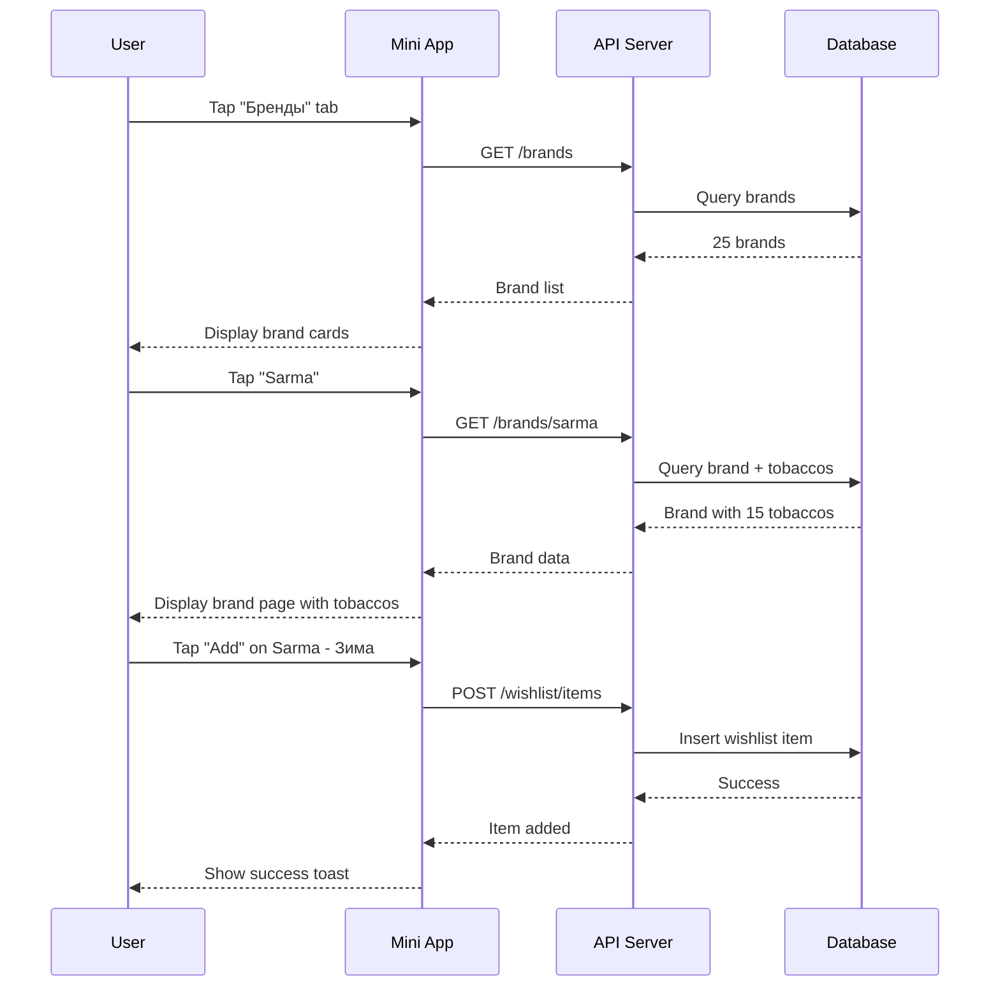
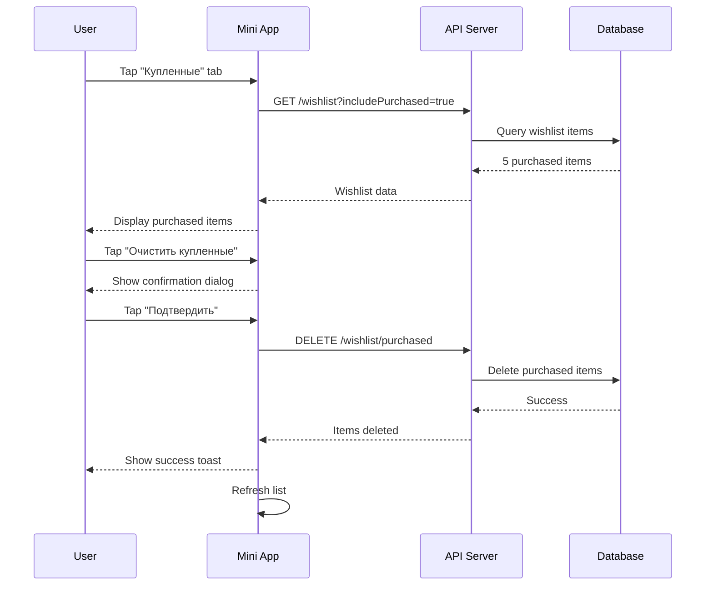

# User Flows

## Overview

This document describes detailed user journeys through the Hookah Wishlist System. Each flow represents a common scenario a user might experience when using the bot or Mini App.

## Flow 1: First-Time User Onboarding

### User Story

As a new user, I want to start using the system so that I can begin managing my hookah tobacco wishlist.

### Flow Diagram



### Step-by-Step

1. **User opens Telegram and finds the bot**
   - User searches for bot or receives link
   - User opens bot chat

2. **User sends `/start` command**
   - Bot receives command
   - Bot checks if user exists in database
   - If not found, creates new user account
   - Bot creates default wishlist for user
   - Bot sends welcome message with:
     - Greeting
     - Brief description of system
     - List of available commands
     - Inline keyboard with quick actions

3. **User explores options**
   - User sees inline keyboard with buttons:
     - "📋 Мой список" (My List)
     - "➕ Добавить" (Add)
     - "📱 Mini App"
   - User can tap buttons or type commands

4. **User opens Mini App (optional)**
   - User taps "📱 Mini App" button
   - Mini App opens in Telegram
   - Mini App receives initData from Telegram
   - Mini App validates initData with API
   - API returns JWT token
   - Mini App stores token for future requests
   - Mini App fetches user's wishlist (empty)
   - Mini App displays empty state with call-to-action

### Success Criteria

- ✅ User account created automatically
- ✅ Default wishlist created
- ✅ Welcome message displayed
- ✅ Mini App accessible and authenticated
- ✅ Empty wishlist shown in Mini App

### Error Scenarios

| Error | Handling |
|--------|-----------|
| Database connection failed | Bot shows error message, asks to try again later |
| Telegram API error | Bot logs error, shows generic error message |
| initData validation failed | Mini App shows error, asks user to restart |

---

## Flow 2: Adding Tobacco via Bot

### User Story

As a user, I want to add a tobacco to my wishlist via bot command so that I can quickly save flavors I discover.

### Flow Diagram



### Step-by-Step

1. **User discovers a tobacco**
   - User sees tobacco in a review, shop, or recommendation
   - User wants to remember it for later purchase

2. **User sends `/add` command**
   - User types `/add Sarma Зима` in bot chat
   - Bot receives command

3. **Bot searches for tobacco**
   - Bot sends search request to API
   - API queries database for matching tobacco
   - API returns search results

4. **Bot handles search results**

   **Scenario A: Exact match found**
   - Bot displays tobacco name and brand
   - Bot adds tobacco to user's wishlist
   - Bot sends confirmation message:
     ```
     ✅ Табак добавлен в список!
     
     Sarma - Зима
     
     [📋 Список] [➕ Еще добавить]
     ```

   **Scenario B: Multiple matches found**
   - Bot displays numbered list of matches
   - User replies with number
   - Bot adds selected tobacco to wishlist
   - Bot sends confirmation

   **Scenario C: No match found**
   - Bot offers to add as custom tobacco
   - User confirms or cancels
   - If confirmed, bot adds as custom item
   - Bot sends confirmation:
     ```
     ✅ Табак добавлен в список!
     
     Custom Tobacco from Custom Brand
     (Табак не найден в базе, добавлен как пользовательский)
     
     [📋 Список] [➕ Еще добавить]
     ```

   **Scenario D: Already in wishlist**
   - Bot detects duplicate
   - Bot sends message:
     ```
     ⚠️ Этот табак уже есть в вашем списке!
     
     Sarma - Зима
     
     [📋 Список] [➕ Другой табак]
     ```

### Success Criteria

- ✅ Tobacco added to wishlist
- ✅ Confirmation message displayed
- ✅ Quick actions provided
- ✅ Duplicate detection works

### Error Scenarios

| Error | Handling |
|--------|-----------|
| Invalid command format | Bot shows usage example |
| Database error | Bot shows error message, asks to try again |
| API timeout | Bot shows timeout message, suggests retry |

---

## Flow 3: Viewing Wishlist via Bot

### User Story

As a user, I want to view my wishlist via bot command so that I can see what I need to buy.

### Flow Diagram



### Step-by-Step

1. **User sends `/list` command**
   - User types `/list` in bot chat
   - Bot receives command

2. **Bot fetches wishlist**
   - Bot sends request to API
   - API queries database for user's wishlist
   - API returns wishlist items

3. **Bot formats response**

   **Scenario A: Wishlist has items**
   - Bot formats items as numbered list
   - Each item shows brand and name
   - Bot displays total count
   - Bot sends message:
     ```
     📋 Ваш список покупок:
     
     1. Sarma - Зима
     2. Tangiers - Cane Mint
     3. Adalya - Love 66
     
     Всего: 3 товара
     
     [📱 Mini App] [➕ Добавить] [🗑️ Очистить]
     ```

   **Scenario B: Wishlist is empty**
   - Bot sends empty state message:
     ```
     📋 Ваш список покупок пуст
     
     Добавьте первый табак командой /add или через Mini App!
     
     [➕ Добавить] [📱 Mini App]
     ```

   **Scenario C: Wishlist has many items**
   - Bot limits to first 20 items
   - Bot shows "и еще X товаров..." message
   - Bot suggests using Mini App for full list

4. **User can take actions**
   - User can tap inline buttons for quick actions
   - User can type commands for specific actions

### Success Criteria

- ✅ Wishlist items displayed
- ✅ Total count shown
- ✅ Quick actions provided
- ✅ Empty state handled

### Error Scenarios

| Error | Handling |
|--------|-----------|
| Database error | Bot shows error message, asks to try again |
| No wishlist found | Bot creates default wishlist, shows empty state |

---

## Flow 4: Removing Item via Bot

### User Story

As a user, I want to remove an item from my wishlist via bot so that I can clean up my list.

### Flow Diagram



### Step-by-Step

1. **User sends `/remove` command**
   - User types `/remove` in bot chat
   - Bot receives command

2. **Bot displays numbered list**
   - Bot fetches user's wishlist
   - Bot formats items as numbered list
   - Bot sends message:
     ```
     🗑️ Удаление товара
     
     Выберите номер товара для удаления:
     
     1. Sarma - Зима
     2. Tangiers - Cane Mint
     3. Adalya - Love 66
     
     [Отмена]
     ```

3. **User selects item to remove**
   - User replies with item number (e.g., "1")
   - Bot receives selection

4. **Bot removes item**
   - Bot sends delete request to API
   - API deletes item from database
   - API confirms success

5. **Bot confirms removal**
   - Bot sends confirmation message:
     ```
     ✅ Табак удален из списка!
     
     Sarma - Зима
     
     [📋 Список] [➕ Добавить]
     ```

6. **User can cancel**
   - User can tap "Отмена" button
   - Bot cancels operation
   - Bot returns to main menu

### Success Criteria

- ✅ Item removed from wishlist
- ✅ Confirmation message displayed
- ✅ Quick actions provided
- ✅ Cancellation supported

### Error Scenarios

| Error | Handling |
|--------|-----------|
| Invalid number | Bot shows error, asks to enter valid number |
| Item not found | Bot shows error, refreshes list |
| Database error | Bot shows error message, asks to try again |

---

## Flow 5: Searching and Adding via Mini App

### User Story

As a user, I want to search for tobaccos in Mini App and add them to my wishlist so that I can discover new flavors.

### Flow Diagram



### Step-by-Step

1. **User opens Mini App**
   - User taps Mini App button in bot
   - Mini App loads
   - Mini App authenticates with API
   - Mini App displays home screen (wishlist)

2. **User navigates to search**
   - User taps "Поиск" (Search) tab in bottom navigation
   - Mini App shows search page
   - Search input field is focused

3. **User searches for tobacco**
   - User types "мята" (mint) in search input
   - Mini App debounces input (waits 300ms)
   - Mini App sends search request to API
   - API queries database for matching tobaccos
   - API returns search results

4. **Mini App displays results**
   - Mini App shows tobacco cards for each result
   - Each card displays:
     - Tobacco image (from htreviews.org)
     - Brand name
     - Tobacco name
     - "Add to wishlist" button

5. **User adds tobacco to wishlist**
   - User taps "Add to wishlist" button on Sarma - Зима
   - Mini App sends POST request to API
   - API validates request
   - API inserts item into database
   - API returns success

6. **Mini App confirms addition**
   - Mini App shows success toast notification
   - Mini App updates wishlist count in navigation
   - Mini App disables "Add" button for that item
   - Mini App provides haptic feedback

### Success Criteria

- ✅ Search results displayed
- ✅ Tobacco added to wishlist
- ✅ Success notification shown
- ✅ Wishlist count updated
- ✅ Haptic feedback provided

### Error Scenarios

| Error | Handling |
|--------|-----------|
| No results | Mini App shows "No results" message |
| Network error | Mini App shows error toast, offers retry |
| Already in wishlist | Mini App shows "Already added" message |
| API error | Mini App shows error toast |

---

## Flow 6: Viewing Wishlist in Mini App

### User Story

As a user, I want to view my wishlist in Mini App so that I can see images and details of tobaccos I want to buy.

### Flow Diagram



### Step-by-Step

1. **User opens Mini App**
   - Mini App loads and authenticates
   - Mini App displays home screen

2. **Mini App fetches wishlist**
   - Mini App sends GET request to `/wishlist`
   - API queries database for user's wishlist
   - API returns wishlist items with tobacco details

3. **Mini App displays wishlist**

   **Scenario A: Wishlist has items**
   - Mini App shows list of wishlist items
   - Each item displays:
     - Tobacco image (from htreviews.org)
     - Brand name
     - Tobacco name
     - "Remove" button
     - "Mark as purchased" button
   - Items are sorted by creation date (newest first)

   **Scenario B: Wishlist is empty**
   - Mini App shows empty state illustration
   - Mini App displays message:
     ```
     Ваш список покупок пуст
     
     Добавьте первый табак через поиск!
     ```
   - Mini App shows "Go to search" button

4. **User can interact with items**
   - User can tap item to view details
   - User can tap "Remove" to delete item
   - User can tap "Mark as purchased" to update status

### Success Criteria

- ✅ Wishlist items displayed with images
- ✅ Brand and name shown
- ✅ Quick actions available
- ✅ Empty state handled
- ✅ Loading states shown

### Error Scenarios

| Error | Handling |
|--------|-----------|
| Network error | Mini App shows error toast, offers retry |
| API error | Mini App shows error message |
| Image load failed | Mini App shows placeholder image |

---

## Flow 7: Marking Item as Purchased

### User Story

As a user, I want to mark an item as purchased so that I can track what I've bought.

### Flow Diagram



### Step-by-Step

1. **User views wishlist**
   - User opens Mini App
   - Mini App displays wishlist items

2. **User marks item as purchased**
   - User taps "Mark as purchased" button on Sarma - Зима
   - Mini App shows confirmation dialog:
     ```
     Отметить как купленный?
     
     Sarma - Зима
     
     [Отмена] [Подтвердить]
     ```
   - User taps "Подтвердить" (Confirm)

3. **Mini App updates item**
   - Mini App sends PATCH request to API
   - API updates item status to purchased
   - API records purchase date
   - API returns updated item

4. **Mini App confirms update**
   - Mini App shows success toast:
     ```
     ✅ Отмечено как купленное
     ```
   - Mini App moves item to "Purchased" section
   - Mini App provides haptic feedback
   - Mini App updates purchase count

5. **User can view purchased items**
   - User taps "Купленные" (Purchased) tab
   - Mini App shows list of purchased items
   - Each item shows purchase date
   - Items can be removed or cleared

### Success Criteria

- ✅ Item marked as purchased
- ✅ Purchase date recorded
- ✅ Item moved to purchased section
- ✅ Success notification shown
- ✅ Haptic feedback provided

### Error Scenarios

| Error | Handling |
|--------|-----------|
| Network error | Mini App shows error toast, offers retry |
| API error | Mini App shows error message |
| Item not found | Mini App shows error, refreshes list |

---

## Flow 8: Browsing by Brand

### User Story

As a user, I want to browse tobaccos by brand so that I can explore a specific brand's offerings.

### Flow Diagram



### Step-by-Step

1. **User navigates to brands**
   - User taps "Бренды" (Brands) tab in bottom navigation
   - Mini App shows brands page

2. **Mini App fetches brands**
   - Mini App sends GET request to `/brands`
   - API queries database for all brands
   - API returns list of brands

3. **Mini App displays brands**
   - Mini App shows grid of brand cards
   - Each card displays:
     - Brand name
     - Brand logo (if available)
     - Number of tobaccos
   - Brands are sorted alphabetically

4. **User selects a brand**
   - User taps on "Sarma" brand
   - Mini App navigates to brand page

5. **Mini App fetches brand tobaccos**
   - Mini App sends GET request to `/brands/sarma`
   - API queries database for brand details and tobaccos
   - API returns brand with list of tobaccos

6. **Mini App displays brand page**
   - Mini App shows brand header with name
   - Mini App displays list of tobaccos
   - Each tobacco displays:
     - Tobacco image
     - Tobacco name
     - "Add to wishlist" button

7. **User adds tobacco to wishlist**
   - User taps "Add to wishlist" button
   - Mini App sends POST request to API
   - API adds item to wishlist
   - Mini App confirms addition

### Success Criteria

- ✅ Brands displayed
- ✅ Brand page shows tobaccos
- ✅ Tobacco can be added to wishlist
- ✅ Smooth navigation between pages

### Error Scenarios

| Error | Handling |
|--------|-----------|
| No tobaccos for brand | Mini App shows empty state |
| Network error | Mini App shows error toast, offers retry |
| Brand not found | Mini App shows 404 page |

---

## Flow 9: Clearing Purchased Items

### User Story

As a user, I want to clear all purchased items so that I can clean up my purchase history.

### Flow Diagram



### Step-by-Step

1. **User views purchased items**
   - User taps "Купленные" (Purchased) tab
   - Mini App shows list of purchased items

2. **User initiates clear**
   - User taps "Очистить купленные" (Clear purchased) button
   - Mini App shows confirmation dialog:
     ```
     Очистить все купленные товары?
     
     Это действие нельзя отменить.
     
     [Отмена] [Подтвердить]
     ```

3. **User confirms**
   - User taps "Подтвердить" (Confirm)
   - Mini App sends DELETE request to API
   - API deletes all purchased items from wishlist
   - API confirms success

4. **Mini App confirms deletion**
   - Mini App shows success toast:
     ```
     ✅ Купленные товары очищены
     ```
   - Mini App refreshes list (now empty)
   - Mini App provides haptic feedback

5. **Mini App shows empty state**
   - Mini App displays empty state:
     ```
     Купленных товаров нет
     
     [📋 Активные]
     ```

### Success Criteria

- ✅ All purchased items deleted
- ✅ Confirmation dialog shown
- ✅ Success notification displayed
- ✅ List refreshed
- ✅ Empty state shown

### Error Scenarios

| Error | Handling |
|--------|-----------|
| Network error | Mini App shows error toast, offers retry |
| API error | Mini App shows error message |
| No purchased items | Mini App shows "Nothing to clear" message |

---

## Flow 10: Error Recovery

### User Story

As a user, I want the system to handle errors gracefully so that I can continue using the app without frustration.

### Error Scenarios

#### Scenario 1: Network Error

1. **User encounters network error**
   - User tries to add item to wishlist
   - Network request fails
   - Mini App shows error toast:
     ```
     ❌ Ошибка сети
     
     Проверьте подключение к интернету и попробуйте снова.
     
     [Повторить]
     ```

2. **User retries**
   - User taps "Повторить" (Retry)
   - Mini App resends request
   - If successful, shows success message
   - If still failing, shows error again

#### Scenario 2: API Error

1. **User encounters API error**
   - User tries to view wishlist
   - API returns 500 error
   - Mini App shows error message:
     ```
     ❌ Ошибка сервера
     
     Мы работаем над устранением проблемы. Попробуйте позже.
     
     [Обновить]
     ```

2. **User refreshes**
   - User taps "Обновить" (Refresh)
   - Mini App resends request
   - If successful, shows data
   - If still failing, shows error again

#### Scenario 3: Authentication Error

1. **User encounters auth error**
   - User tries to access protected resource
   - API returns 401 error
   - Mini App shows error message:
     ```
     ❌ Ошибка авторизации
     
     Необходимо войти снова.
     
     [Войти]
     ```

2. **User re-authenticates**
   - User taps "Войти" (Login)
   - Mini App re-validates Telegram initData
   - Mini App receives new JWT token
   - Mini App retries request

### Success Criteria

- ✅ Clear error messages displayed
- ✅ Recovery options provided
- ✅ User can retry failed operations
- ✅ Authentication errors handled gracefully

---

## Summary

The Hookah Wishlist System provides smooth, intuitive user flows for:

✅ **Onboarding** - Easy first-time user experience
✅ **Bot interactions** - Quick command-based operations
✅ **Mini App experience** - Rich, visual interface
✅ **Wishlist management** - Add, view, remove items
✅ **Discovery** - Search and browse tobaccos
✅ **Purchase tracking** - Mark and manage purchases
✅ **Error handling** - Graceful recovery from errors

Each flow is designed to be:
- **Intuitive** - Clear next steps for users
- **Efficient** - Minimal steps to complete tasks
- **Forgiving** - Error recovery and confirmation dialogs
- **Responsive** - Fast feedback and loading states
- **Accessible** - Works on mobile devices
